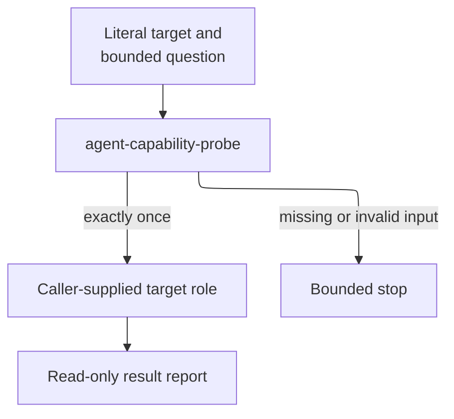

# agent-capability-probe - as-is

## Purpose

Provide a fixture-only, read-only role for testing one bounded in-process agent call without creating implementation or delegation authority.

## Design

The probe accepts one caller-supplied literal target role and one bounded question, calls that exact target at most once, and reports the result. It stops when the target or question is missing and never substitutes a role or turns the probe into work.

**Lineage**: [as-is](../../as-is.md#design) / [agents](../as-is.md#design) / **agent-capability-probe**

### Literal-target probe boundary

| Concern | Rule |
| --- | --- |
| Purpose | Remain a disposable fixture-only and read-only capability probe. |
| Target | Call only the caller-supplied literal target role; never substitute a role. |
| Cardinality | Make exactly one in-process call and never make a second call. |
| Prohibitions | Do not implement, mutate, delegate work, or commit. |
| Stop | Stop when the target or bounded question is missing. |

## Links

- [`agent.md`](agent.md) — canonical literal-target and one-call contract.
- [Agents roster](../as-is.md#design) — F8 admission context.
