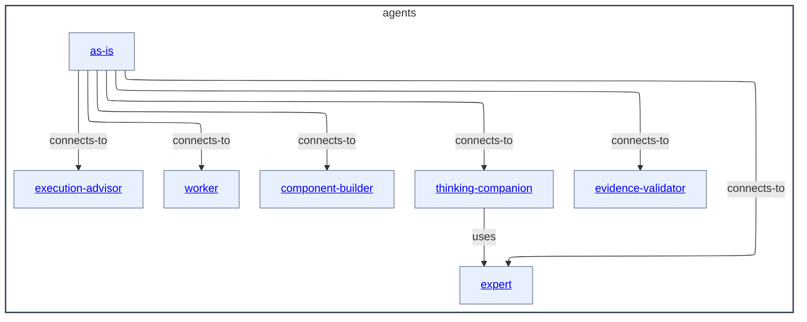

# agents - as-is

## Purpose

Organize independent configured agent roles and their durable capability and authority context.

## Components

| Component | Purpose |
| --- | --- |
| [as-is](as-is/as-is.md#design) | Interpret user-facing requests and route substantive work. |
| [component-builder](component-builder/as-is.md#design) | Build bounded components and maintain their records. |
| [execution-advisor](execution-advisor/as-is.md#design) | Analyze execution traces and readable local session data. |
| [evidence-validator](evidence-validator/as-is.md#design) | Validate bounded controlled-worktree evidence. |
| [expert](expert/as-is.md#design) | Provide read-only cross-domain consultation and review. |
| [thinking-companion](thinking-companion/as-is.md#design) | Help humans examine questions and ideas. |
| [worker](worker/as-is.md#design) | Perform authorized bounded component implementation with structured reporting, without committing or delegating. |

## Design

Agents maps independent role boundaries, supported role connections, and capability-admission context without imposing a fixed delegation chain.

[as-is](../as-is.md#design) / **agents**

### Independent role container

- Pre-render layout plan: use the available repository Markdown Mermaid surface without assuming fixed dimensions; keep the seven child boxes as a balanced relationship map in a top-to-bottom container, with the existing seven supported arrows and short labels as the edge-density budget. Rendered geometry and link behavior remain untested because no local renderer is configured.

The child boxes link directly to the seven child records, and the Components table is the required Markdown and renderer fallback. The arrows show supported role connections rather than a mandatory execution sequence: `as-is` connects to independently selectable roles when their admitted capabilities fit, and thinking-companion uses expert only for materially complex consultation. Reusable skills, host admission, and durable task records provide procedure, capability, and current-authority context without becoming Agents children. Roles remain independently selectable; agents and orchestrators retain authority to select, authorize, start, observe, recover, cancel, and delegate, while a mechanical adapter does not transfer that authority. Component-builder owns component-work integration, evidence-validator and expert provide bounded read-only review, and worker performs authorized bounded component implementation with structured reporting while not committing or delegating. The diagram shows only documented immediate role components.

## Boundary

Canonical role files declare ordinary Pi tools in front matter. Launcher admission validates and forwards those declarations without injecting tools by agent identity; the owning Pi host/package supplies executable implementations. Unsupported, unavailable, or unauthorized tools fail closed before launch. Read-only roles may still receive explicit host safety caps.

## Links

- [spawning-pi-subagents](../skills/spawning-pi-subagents/SKILL.md) — host/package admission contract distinct from the child-role catalog.
