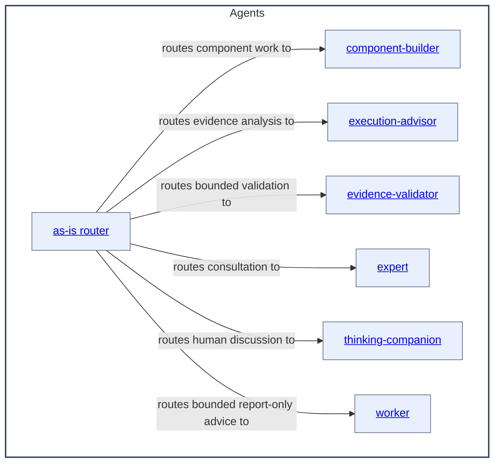

# Agents - as-is

## Purpose
Maintain the durable task context and organization for independent configured agent roles.

## Capability contract
Canonical role files declare ordinary Pi tools in front matter. Launcher
admission validates and forwards those declarations without injecting tools by
agent identity; the owning Pi host/package supplies executable implementations.
Unsupported, unavailable, or unauthorized tools fail closed before launch.
Read-only roles may still receive explicit host safety caps.

## Components

| Component | Purpose |
| --- | --- |
| [as-is router](as-is/as-is.md#design) | Interpret user-facing requests and route substantive work. |
| [component-builder](component-builder/as-is.md#design) | Build bounded components and maintain their records. |
| [execution-advisor](execution-advisor/as-is.md#design) | Analyze execution traces and readable local session data. |
| [evidence-validator](evidence-validator/as-is.md#design) | Validate bounded controlled-worktree evidence. |
| [expert](expert/as-is.md#design) | Provide read-only cross-domain consultation and review. |
| [thinking-companion](thinking-companion/as-is.md#design) | Help humans examine questions and ideas. |
| [worker](worker/as-is.md#design) | Provide bounded read-only in-process assistance. |

## Design

This is the container view for the documented agent components owned by the Agents component. The diagram shows supported routing relationships between independent roles, not a mandatory delegation chain. Reverse navigation to the parent is kept as a nearby Markdown link.

Parent: [as-is](../as-is.md#design)

The arrows show supported routing relationships, not a fixed execution sequence. Roles remain independently selectable; reusable skills, host admission, and durable task records provide procedures, capabilities, and current authority without becoming child components of Agents. An agent role combines reusable skills with permissions, tools, model settings, and bounded responsibility. Agents and orchestrators retain authority to select, authorize, start, observe, recover, cancel, and delegate; a mechanical adapter invoked from a skill does not transfer that authority. Subagents are generalized independent workers for bounded implementation, research, review, planning, recovery, or other approved flows. Delegation uses a bounded input, expected output, and verification boundary, and its result is preserved in repository context before dependent work proceeds. Independent review or validation is used when risk, authority, or change breadth warrants it; an implementing agent's report is evidence, not the sole completion gate. The component-builder owns validation and integration for component work, while evidence-validator and expert provide bounded read-only review and worker assistance is report-only. The diagram shows the documented immediate role components; role files without records remain linked below rather than promoted into this map.

## Links

- [as-is/agent.md](as-is/agent.md) — canonical primary role contract.
- [component-builder/agent.md](component-builder/agent.md) — canonical recursive builder role contract.
- [expert/agent.md](expert/agent.md) — canonical read-only consultation contract.
- [evidence-validator/agent.md](evidence-validator/agent.md) — canonical read-only repository evidence validator contract.
- [thinking-companion/agent.md](thinking-companion/agent.md) — canonical human-facing consultation contract.
- [worker/agent.md](worker/agent.md) — canonical bounded implementation contract.
- [spawning-pi-subagents](../skills/spawning-pi-subagents/SKILL.md) — host/package admission contract.
