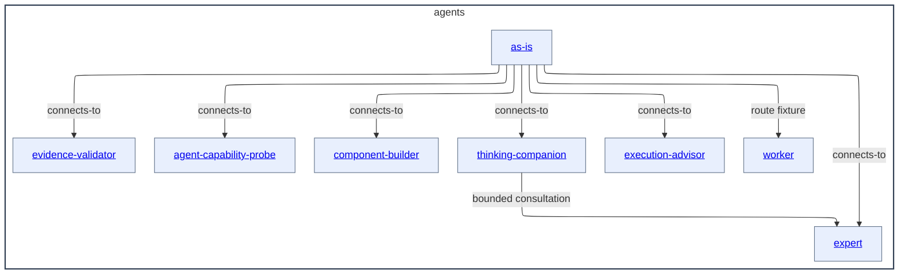

# agents - as-is

## Purpose

Organize the exact F8 roster of independently selectable role contracts and their durable capability and authority context.

## Components

| Component | Purpose |
| --- | --- |
| [as-is](as-is/as-is.md#design) | Interpret user-facing requests and route substantive work without authorizing it. |
| [component-builder](component-builder/as-is.md#design) | Build one bounded component under the adopted component-building procedures. |
| [evidence-validator](evidence-validator/as-is.md#design) | Validate supplied controlled-worktree evidence through a fixed read-only profile. |
| [execution-advisor](execution-advisor/as-is.md#design) | Analyze bounded trace and session evidence without owning execution or budget. |
| [expert](expert/as-is.md#design) | Provide bounded, read-only cross-domain consultation. |
| [thinking-companion](thinking-companion/as-is.md#design) | Help humans examine questions while preserving their agency. |
| [agent-capability-probe](agent-capability-probe/as-is.md#design) | Exercise one literal, bounded in-process role call as a read-only fixture. |
| [worker](worker/as-is.md#design) | Retain the transient candidate implementation-route fixture outside the F8 installed roster. |

## Design

The F8 roster contains exactly these seven installed role contracts. Role records describe purpose, boundaries, and navigation; adopted skills describe reusable mechanics; runtime and control-plane surfaces provide deterministic admission and limit enforcement. No `design-prototyper` role is installed in F8.

**Lineage**: [as-is](../as-is.md#design) / **agents**

### Independent role container

The seven F8 role boxes and the retained transient worker fixture link to their records; the Components table is the Markdown and renderer fallback. Arrows show supported role connections, not a mandatory execution sequence.

| Concern | Durable rule |
| --- | --- |
| Roster | F8 admits `as-is`, `component-builder`, `evidence-validator`, `execution-advisor`, `expert`, `thinking-companion`, and `agent-capability-probe`, with no `design-prototyper`; `worker` remains a transient implementation-route fixture outside the roster. |
| Role selection | `as-is` recommends an admitted role whose declared capability fits; recommendation is not authorization. |
| Component mechanics | `component-builder` retains component ownership and semantic integration/completion authority; adopted skills own the detailed build, delegation, validation, recovery, and completion mechanics. |
| Consultation | `thinking-companion` may request one bounded read-only `expert` consultation for a materially complex question. |
| Probe boundary | `agent-capability-probe` is a fixture-only one-call role and cannot become an implementation or delegation path. |
| Capability admission | Role frontmatter declares ordinary tools and permissions; host admission validates the declaration without identity-based capability injection. |
| Runtime boundary | Control-plane and launcher runtime checks are distinct from role prose and skill descriptions; role or skill text does not itself enforce runtime limits. |
| Failure behavior | Unsupported, unavailable, or unauthorized capability stops with a bounded blocker rather than substitution or inferred authority. |

## Links

- [spawning-subagents](../skills/spawning-subagents/SKILL.md) — approved host admission and launch procedure.
