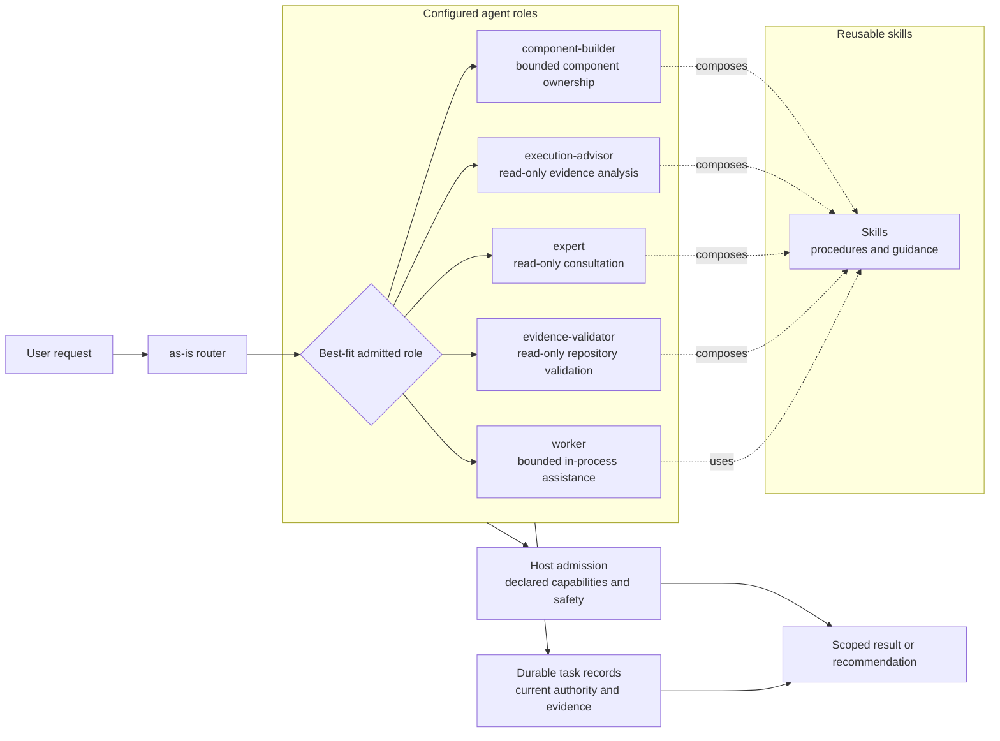

# Agents

## Purpose
Maintain the durable task context and organization for independent configured agent roles.

## Capability contract
Canonical role files declare ordinary Pi tools in front matter. Launcher
admission validates and forwards those declarations without injecting tools by
agent identity; the owning Pi host/package supplies executable implementations.
Unsupported, unavailable, or unauthorized tools fail closed before launch.
Read-only roles may still receive explicit host safety caps.

## Design

The agents area is the authority-bearing composition layer for configured roles.
Roles are independently selectable; reusable skills provide procedures but do
not select, authorize, start, or delegate agents. The diagram shows the
repository-facing boundaries rather than a mandatory delegation sequence.

A role owns the authority decisions and lifecycle defined by its contract;
admission supplies executable capabilities, and task records supply current
scope and evidence. The agents area does not own skill implementation, host
admission, or another role's task state.

If Mermaid navigation is unavailable, use the role contracts in the [Links](#links)
section below.

## Components

| Component | Purpose |
| --- | --- |
| [as-is router](as-is/as-is.md#design) | Interpret user-facing requests and route substantive work. |
| [component-builder](component-builder/as-is.md#design) | Build bounded components and maintain their records. |
| [execution-advisor](execution-advisor/as-is.md#design) | Analyze execution traces and readable local session data. |
| [worker](worker/as-is.md#design) | Provide bounded in-process assistance. |

## Links

- [as-is/agent.md](as-is/agent.md) — canonical primary role contract.
- [component-builder/agent.md](component-builder/agent.md) — canonical recursive builder role contract.
- [expert/agent.md](expert/agent.md) — canonical read-only general consultation contract.
- [evidence-validator/agent.md](evidence-validator/agent.md) — canonical read-only repository evidence validator contract.
- [worker/agent.md](worker/agent.md) — canonical bounded implementation contract.
- [spawning-pi-subagents](../skills/spawning-pi-subagents/SKILL.md) — host/package admission contract.
