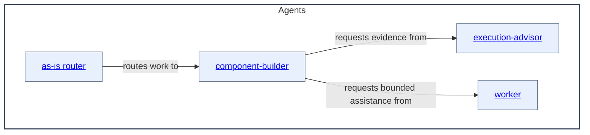

# Agents - as-is

[Open repository design](../as-is.md#design)

## Purpose
Maintain the durable task context and organization for independent configured agent roles.

## Capability contract
Canonical role files declare ordinary Pi tools in front matter. Launcher
admission validates and forwards those declarations without injecting tools by
agent identity; the owning Pi host/package supplies executable implementations.
Unsupported, unavailable, or unauthorized tools fail closed before launch.
Read-only roles may still receive explicit host safety caps.

## Components

| Component | Purpose |
| --- | --- |
| [as-is router](as-is/as-is.md#design) | Interpret user-facing requests and route substantive work. |
| [component-builder](component-builder/as-is.md#design) | Build bounded components and maintain their records. |
| [execution-advisor](execution-advisor/as-is.md#design) | Analyze execution traces and readable local session data. |
| [worker](worker/as-is.md#design) | Provide bounded read-only in-process assistance. |

## Design

This is the container view for the documented agent components owned by the
Agents component. The container diagram uses the actual Agents component name and linked child
boxes. Reverse navigation to the parent is kept as a nearby Markdown link.

Parent: [as-is](../as-is.md#design)

The diagram shows only the immediate documented children; other role files are
linked below but are not separate component nodes until they have their own
component records.

## Links

- [as-is/agent.md](as-is/agent.md) — canonical primary role contract.
- [component-builder/agent.md](component-builder/agent.md) — canonical recursive builder role contract.
- [expert/agent.md](expert/agent.md) — canonical read-only general consultation contract.
- [evidence-validator/agent.md](evidence-validator/agent.md) — canonical read-only repository evidence validator contract.
- [worker/agent.md](worker/agent.md) — canonical bounded implementation contract.
- [spawning-pi-subagents](../skills/spawning-pi-subagents/SKILL.md) — host/package admission contract.
