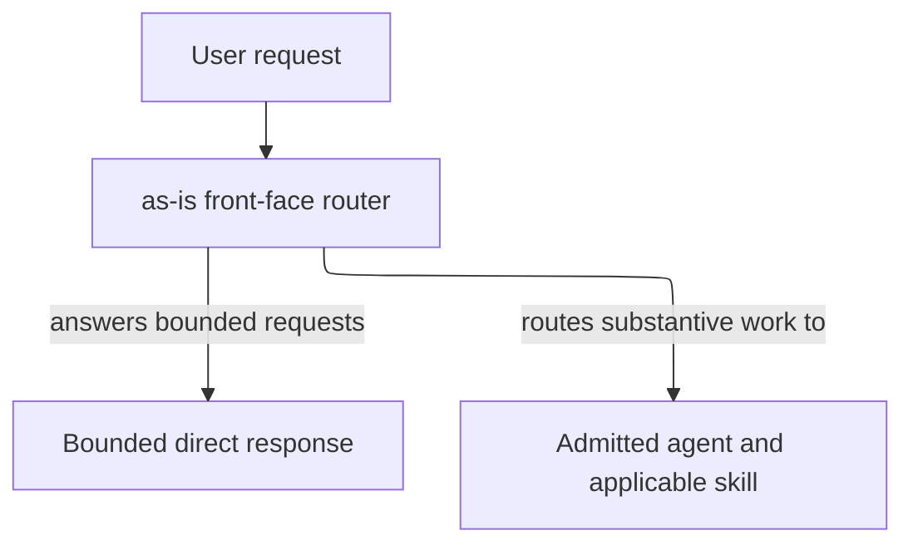
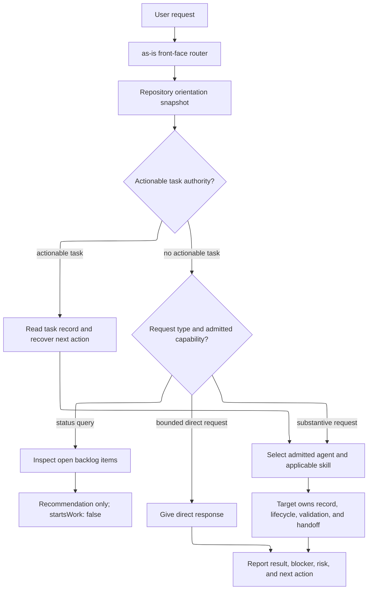

# as-is - as-is

## Purpose

The `agents/as-is` component owns the user-facing `as-is` front-face router contract. It interprets intent, gives lightweight direct responses, and routes sizable or substantive work to the optimal admitted agent and applicable skill based on their descriptions and current task authority. It does not assume a fixed delegation chain, own another agent's lifecycle, or implement component work.

## Design

The router answers only bounded direct requests and otherwise routes work to an admitted target without acquiring that target's authority.

**Lineage**: [as-is](../../as-is.md#design) / [agents](../as-is.md#design) / **as-is**

### Routing authority boundary

- Interpret user intent and route substantive requests to the best admitted agent and applicable skill.
- Use durable repository context for orientation without inventing task authority for simple queries.
- Leave task records, implementation, delegation, validation, and completion to the selected target's contract.
- Avoid imposing a universal mediation chain.

### Status and work routing

The router keeps conversation handling lightweight:

| Input or decision | Router behavior |
| --- | --- |
| Current state | Read durable task records; use the orientation snapshot for compact context. |
| Substantive work | Route to the best admitted agent rather than a universal `component-builder` chain. |
| Target contract | Let the selected target determine its skills, task record, delegation, validation, and handoff. |
| Backlog lookup | Inform the user only; never authorize or start work. |

## Relationships

| Relationship or boundary | Rule |
| --- | --- |
| Role selection | Agent roles are independently selectable; no agent is intrinsically bound to another. |
| Routing | The router connects substantive work to an admitted target and applicable skill. |
| Target authority | The selected target's description, task authority, and procedure govern task records, workers, validation, recovery, and handoff. |
| Router limit | The router does not impose a fixed delegation chain or own another agent's lifecycle or component work. |
| Owned scope | This component owns the `as-is` entrypoint/front-face contract and local context links. |
| Excluded scope | It does not own another agent's lifecycle, component implementation, parent or sibling records, or orientation implementation. |
| Descendants | Descendants without their own `as-is.md` remain within this component boundary. |
| Checkout | The initial checkout includes the relevant component folder and child directories; sparse checkout is deferred until evidence demonstrates need. |
## Links

- [`agent.md`](agent.md) — canonical user-facing routing and delegation contract.
