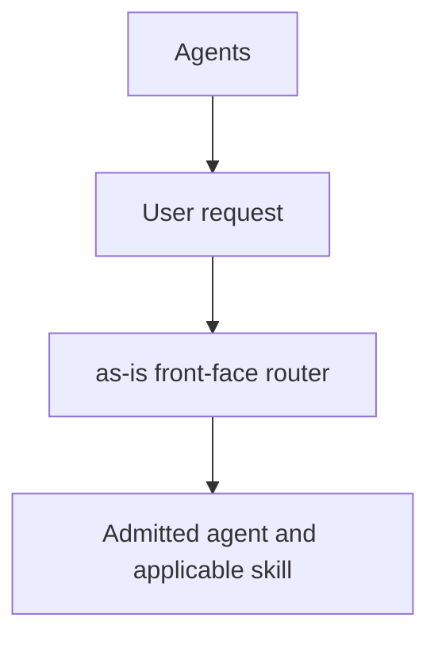
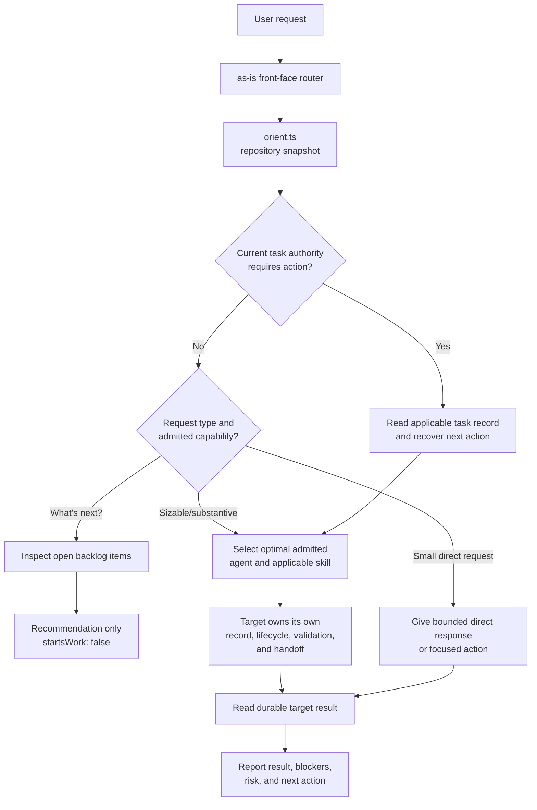

# as-is Component

## Independence

Agent roles are independent. No agent is intrinsically bound to another, and
an authorized agent may delegate to any suitable target. Target selection and
any required task record, worker, validation, recovery, or handoff follow the
selected target's description, current task authority, and applicable
procedure.

## Purpose

The `agents/as-is` component owns the user-facing `as-is` front-face router
contract. It interprets intent, gives lightweight direct responses, and routes
sizable or substantive work to the optimal admitted agent and applicable skill
based on their descriptions and current task authority. It does not assume a
fixed delegation chain, own another agent's lifecycle, or implement component
work.

## Design

The component is organized around the following relationships and flow.

[Open Agents design](../as-is.md#design)

- Interpret user intent and route substantive requests to the best admitted
  agent and applicable skill.
- Use durable repository context for orientation without inventing task
  authority for simple queries.
- Leave task records, implementation, delegation, validation, and completion
  to the selected target's contract.
- Avoid imposing a universal mediation chain.

## Observed Live Behavior

The independent live baseline in `live-behavioral.test.ts` was run with the
real Pi provider on 2026-08-06 using the literal user request `What's next?`.
Three isolated scenarios passed in 58.24 seconds (3 tests, 16 assertions):

- The literal `What's next?` request returns task or backlog context as a
  recommendation, reports no work start, and leaves the repository unchanged.
- A substantive cross-component request identifies the appropriate authority
  and next action without implementing, delegating, creating a task, or
  claiming completion.
- A request explicitly forbidding self-delegation reports the self-target
  rejection without launching a child or changing repository state.

The assertions intentionally check semantic behavior rather than exact model
wording. Registry and trace directories are isolated per scenario, and no
child launch or repository mutation was observed. The post-baseline contract
uses declared capability and explicit admission rather than naming a required
implementation, review, or downstream role. Provider response wording and
latency remain model-dependent residual risks.

The router keeps conversation handling lightweight: durable task records are
used for current state, `orient.ts` supplies a compact snapshot, and sizable
work is routed to the best admitted agent rather than a universal fixed
`component-builder` chain. The selected target's own contract determines its
skills, task record, delegation, validation, and handoff. A backlog lookup can
inform the user, but it cannot authorize or start work.

## Relationships

This component is the user-facing entry point for `as-is` requests. It routes
substantive work to an independently admitted agent and applicable skill; the
target owns its own task, lifecycle, delegation, validation, and handoff. The
router does not impose a fixed delegation chain or own another agent's
component work.

## Boundary

This component owns the `as-is` entrypoint/front-face contract and its local
context links. It does not own another agent's lifecycle, component-domain
implementation, parent or sibling records, or the orientation script
implementation. Each target agent owns the lifecycle and handoff required by
its own contract. Descendants without their own `as-is.md` are within this
component boundary. The initial component checkout includes the complete
relevant component folder, including child component directories. Sparse
checkout and mechanical child exclusion are deferred until evidence
demonstrates a need.

## Links

- [`as-is-record-structure.md`](as-is-record-structure.md) — planning contract for durable component-record structure and incremental maintenance.
- [`agent.md`](agent.md) — user-facing routing and delegation contract.
- [`orient.ts`](../../skills/managing-as-is-document/scripts/orient.ts) — repository orientation snapshot used by status/routing turns.
- [`live-behavioral.test.ts`](live-behavioral.test.ts) — opt-in live behavioral baseline for independent routing behavior.
