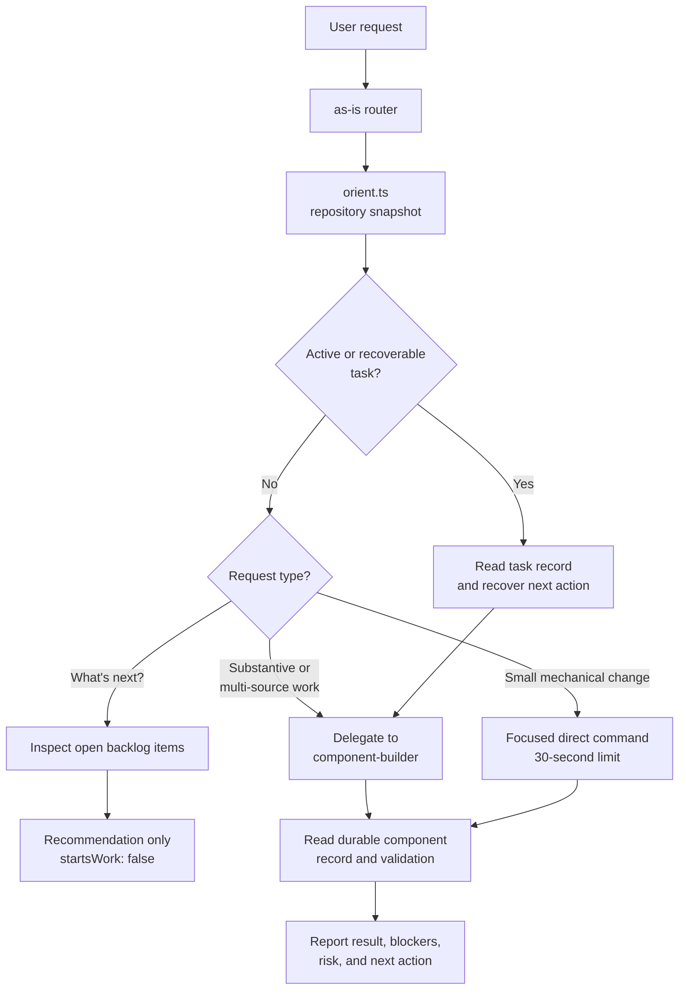

# as-is Component

## Independence

Agent roles are independent. No agent is intrinsically bound to another, and
an authorized agent may delegate to any suitable target. Target selection and
any required task record, worker, validation, recovery, or handoff follow the
selected target's description, current task authority, and applicable
procedure.

## Purpose

The `agents/as-is` component owns the user-facing `as-is` front-face router
contract. It interprets intent, gives lightweight direct responses, and routes
sizable or substantive work to the optimal admitted agent and applicable skill
based on their descriptions and current task authority. It does not assume a
fixed delegation chain, own another agent's lifecycle, or implement component
work.

## Design

The router may use current durable repository context for status and routing,
including the orientation snapshot, but does not invent task authority for
simple queries. Sizable implementation is routed to the best admitted agent whose role
supports it; that target's own contract determines whether it requires a
component task record, selects another worker, delegates, validates, or hands
off. A durable task record remains authoritative whenever the applicable
procedure requires one. The worker is an independent bounded implementation
role and may receive delegations from any authorized agent; it is not a
front-face router. The agent contract defines direct-path and contextual
routing, not a universal mediation chain.

## Observed Live Behavior

The independent live baseline in `live-behavioral.test.ts` was run with the
real Pi provider on 2026-08-06 using the literal user request `What's next?`.
Three isolated scenarios passed in 58.24 seconds (3 tests, 16 assertions):

- The literal `What's next?` request returns task or backlog context as a
  recommendation, reports no work start, and leaves the repository unchanged.
- A substantive cross-component request identifies the appropriate authority
  and next action without implementing, delegating, creating a task, or
  claiming completion.
- A request explicitly forbidding self-delegation reports the self-target
  rejection without launching a child or changing repository state.

The assertions intentionally check semantic behavior rather than exact model
wording. Registry and trace directories are isolated per scenario, and no
child launch or repository mutation was observed. The post-baseline contract
uses declared capability and explicit admission rather than naming a required
implementation, review, or downstream role. Provider response wording and
latency remain model-dependent residual risks.

The router keeps conversation handling lightweight: durable task records are
used for current state, `orient.ts` supplies a compact snapshot, and only
substantive work is handed to `component-builder`. A backlog lookup can inform
the user, but it cannot authorize or start work.

## Boundary

This component owns the `as-is` entrypoint/front-face contract and its local
context links. It does not own another agent's lifecycle, component-domain
implementation, parent or sibling records, or the orientation script
implementation. Each target agent owns the lifecycle and handoff required by
its own contract. Descendants without their own `as-is.md` are within this
component boundary.

## Links

- [`agent.md`](agent.md) — user-facing routing and delegation contract.
- [`tasks.md`](tasks.md) — transient current-task record while this component is active.
- [`changelog.md`](changelog.md) — concise historical recovery and completion notes.
- [`backlog.md`](backlog.md) — planning index for this component's open work.
- [`orient.ts`](../../../skills/as-is/scripts/orient.ts) — repository orientation snapshot used by status/routing turns.
- [`live-behavioral.test.ts`](live-behavioral.test.ts) — opt-in live behavioral baseline for independent routing behavior.

## Changelog

The historical task-form content previously embedded in this file was migrated
to the current component model using recovery evidence from commit `b3a86eae`
and the available sibling worktree. Its necessary recovery facts are retained
in `changelog.md`; the current task authority is the configured transient
`tasks.md` record, not this durable context file.
