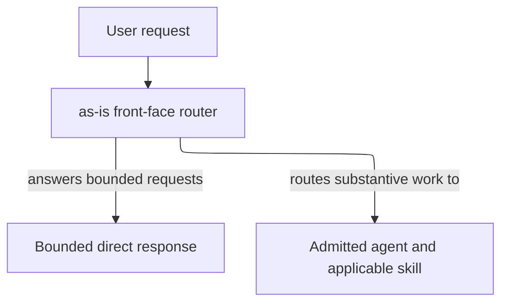
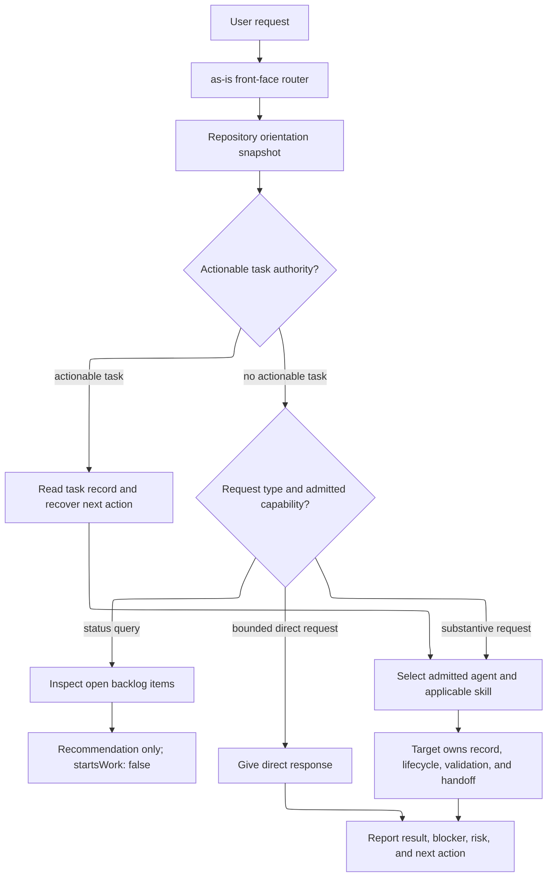

# as-is - as-is

## Purpose

The `agents/as-is` component owns the user-facing `as-is` front-face router contract. It interprets intent, gives lightweight direct responses, and routes sizable or substantive work to the optimal admitted agent and applicable skill based on their descriptions and current task authority. It does not assume a fixed delegation chain, own another agent's lifecycle, or implement component work.

## Design

The router answers only bounded direct requests and otherwise routes work to an admitted target without acquiring that target's authority.

[as-is](../../as-is.md#design) / [agents](../as-is.md#design) / **as-is**

- Pre-render layout plan: Use the Markdown Mermaid render surface with no fixed dimensions; retain a TB/ELK progression from request through router to the two outcomes, with 4 visible nodes and 3 edges kept sparse. Route downward and group the direct-response and admitted-target outcomes as sibling leaves; rendered geometry and label fit remain untested because no local renderer is configured.

### Routing authority boundary

- Interpret user intent and route substantive requests to the best admitted agent and applicable skill.
- Use durable repository context for orientation without inventing task authority for simple queries.
- Leave task records, implementation, delegation, validation, and completion to the selected target's contract.
- Avoid imposing a universal mediation chain.

- Pre-render layout plan: Use the Markdown Mermaid render surface with no fixed dimensions; use a TB/ELK progression for the roughly 12 visible nodes and 13 directed edges, keeping the authority decision and request-type branches readable without adding detail. Route downward from request through recovery or classification, grouping alternate paths before converging on target/contract/report outcomes; rendered geometry, crossings, and label fit remain untested because no local renderer is configured.

### Status and work routing

The router keeps conversation handling lightweight: durable task records are used for current state, the orientation snapshot supplies compact context, and sizable work is routed to the best admitted agent rather than a universal fixed `component-builder` chain. The selected target's own contract determines its skills, task record, delegation, validation, and handoff. A backlog lookup can inform the user, but it cannot authorize or start work.

## Relationships

Agent roles are independently selectable: no agent is intrinsically bound to another. The router connects substantive work to an admitted target and applicable skill, and the selected target's description, current task authority, and procedure govern any required task record, worker, validation, recovery, or handoff. The router does not impose a fixed delegation chain or own another agent's lifecycle or component work.

## Boundary

This component owns the `as-is` entrypoint/front-face contract and its local context links. It does not own another agent's lifecycle, component-domain implementation, parent or sibling records, or the orientation script implementation. Each target agent owns the lifecycle and handoff required by its own contract. Descendants without their own `as-is.md` are within this component boundary. The initial component checkout includes the complete relevant component folder, including child component directories. Sparse checkout and mechanical child exclusion are deferred until evidence demonstrates a need.

## Links

- [`agent.md`](agent.md) — canonical user-facing routing and delegation contract.
