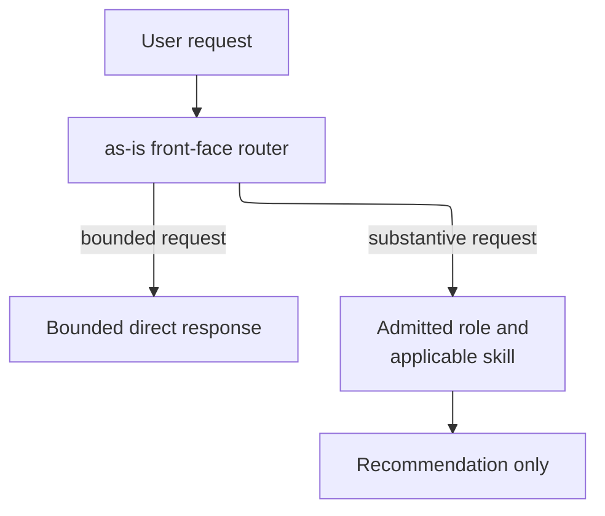

# as-is - as-is

## Purpose

The `as-is` component owns the user-facing router contract. It interprets intent, gives lightweight direct responses, and recommends the best admitted role and applicable skill for substantive work without acquiring that target's authority.

## Design

The router answers only bounded direct requests and otherwise routes to an admitted target. A routing recommendation is not authorization, and the router never starts work from inferred intent.

**Lineage**: [as-is](../../as-is.md#design) / [agents](../as-is.md#design) / **as-is**

### Routing boundary

| Concern | Rule |
| --- | --- |
| Authorization | Report `startsWork: false`; a recommendation is not authorization. |
| Routing | Substantive work requires an admitted authority and a capability fit. |
| Self-targeting | Never delegate to yourself or silently substitute an unavailable target. |
| Intent | Never create a task, start work, or invent task authority from inferred intent, caller identity, telemetry, or process state. |
| Ownership | Leave task records, implementation, delegation, validation, and completion to the selected target. |

## Links

- [`agent.md`](agent.md) — canonical user-facing routing contract.
- [Agents roster](../as-is.md#design) — F8 role selection context.
