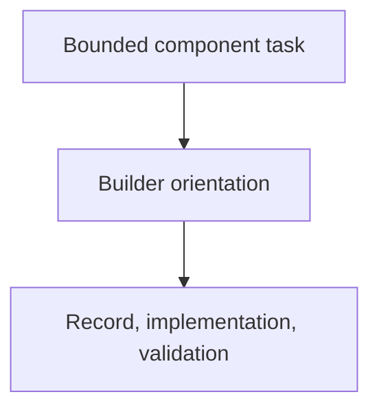

# component-builder Orientation

## Purpose

Build one bounded component and maintain its durable `as-is.md` record. The
builder orients from the component's current context and task authority, then
owns the bounded implementation, explicit child handoff, validation, and
completion decisions required by its role. An orientation script may provide a
faster snapshot when useful; it does not replace builder judgment.

## Design

The component is organized around the following relationships and flow.

## Links
