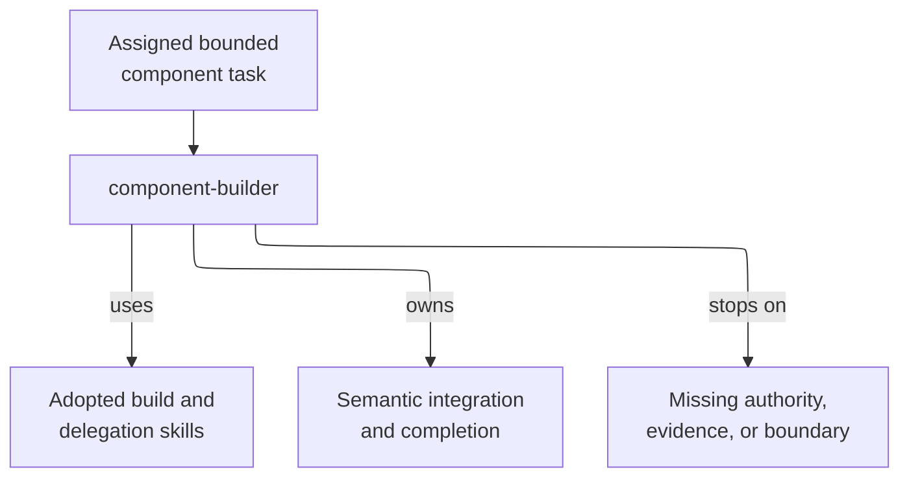

# component-builder - as-is

## Purpose

The `component-builder` role owns one assigned bounded component and its semantic integration and completion decisions. It preserves parent, child, and sibling boundaries while using adopted skills for detailed mechanics.

## Design

The role contract retains component ownership, configured-worker selection, no-substitution, task and durable-record authority, and stop conditions. `building-components`, `delegating-bounded-work`, `spawning-subagents`, and the supporting task, context, validation, and completion skills own the reusable procedures; a skill grants no authority.

**Lineage**: [as-is](../../as-is.md#design) / [agents](../as-is.md#design) / **component-builder**

### Component-builder boundary

| Concern | Rule |
| --- | --- |
| Ownership | Work only within the assigned component; do not edit parent, child, or sibling records. |
| Authority | Durable task and component records outrank caller identity, downstream output, telemetry, and runtime claims. |
| Mechanics | Skills own detailed context, task, delegation, validation, recovery, history, and completion mechanics; skills grant no authority. |
| Worker selection | Use only the configured worker; never substitute an unavailable role or broaden scope. |
| Integration | The builder—not a skill, launcher, child, or telemetry—owns semantic integration and completion. |
| Stop conditions | Stop without proceeding when review, budget admission, capability, scope, handoff, or integration evidence is missing, failed, or unresolved. |

## Links

- [`agent.md`](agent.md) — canonical role authority and boundaries.
- [`../../skills/building-components/SKILL.md`](../../skills/building-components/SKILL.md) — component-building mechanics.
- [`../../skills/delegating-bounded-work/SKILL.md`](../../skills/delegating-bounded-work/SKILL.md) — bounded handoff preparation.
- [`../../skills/spawning-subagents/SKILL.md`](../../skills/spawning-subagents/SKILL.md) — approved child launch and observation procedure.
- [`../../skills/implementing-tasks/SKILL.md`](../../skills/implementing-tasks/SKILL.md) — task lifecycle and child boundaries.
- [`../../skills/building-context/SKILL.md`](../../skills/building-context/SKILL.md) — bounded context composition.
- [`../../skills/validating-changes/SKILL.md`](../../skills/validating-changes/SKILL.md) — validation and evidence selection.
- [`../../skills/committing-completed-work/SKILL.md`](../../skills/committing-completed-work/SKILL.md) — scoped completion handoff.
