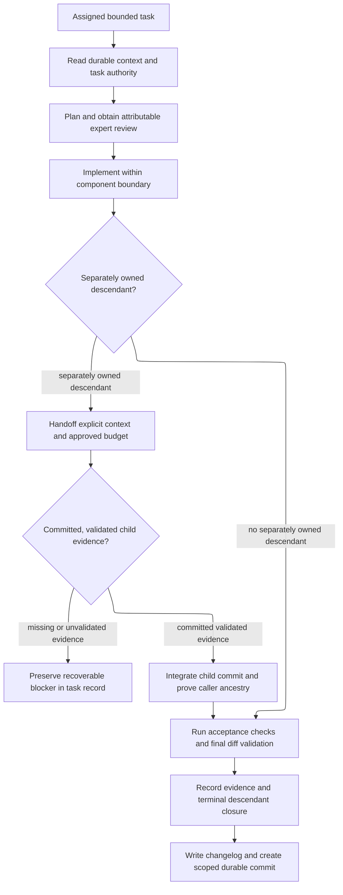

# component-builder - as-is

## Purpose

The `component-builder` role builds one bounded component from its durable
context and current task authority. It owns implementation within that
component, explicit handoffs to separately owned descendants, risk-matched
validation, semantic completion, and the scoped durable handoff. It may use an
orientation snapshot for speed, but the snapshot does not replace judgment or
grant task authority.

## Design

The builder keeps durable component purpose separate from current task state:
`as-is.md` describes the component, `tasks.md` governs the active task, and
`changelog.md` records completed handoffs. It composes focused skills for task
lifecycle, validation, recovery, and committing while retaining role authority
for planning, delegation, descendant closure, and completion. A separately owned
child is not terminal until its scoped result is integrated and caller ancestry
is proved; failed or incomplete child work remains recoverable in the task record.

[as-is](../../as-is.md#design) / [agents](../as-is.md#design) / **component-builder**

- Pre-render layout plan: Use the Markdown Mermaid render surface with no fixed dimensions; use a TB/ELK progression for the roughly 13 visible nodes and 14 directed edges, preserving the delivery sequence while keeping the child decision and evidence branches legible. Route downward through context, review, implementation, handoff/integration, validation, closure, and commit; group alternate blocker and integration paths around their decisions. Rendered geometry, crossings, and label fit remain untested because no local renderer is configured.

### Component delivery and child integration

Same-component assistance and expert reviews use the host-provided in-process
subagent mechanism. A separately owned child is launched through the bounded
Pi subprocess procedure with an explicit context handoff and approved budget.
The receiving builder owns semantic integration; the launcher only observes
mechanical handoff and ancestry.

## Boundary

This component owns the `component-builder` role contract and its durable
orientation record. It may edit the assigned component and descendants that do
not have their own `as-is.md`. A child with its own record is a separate
boundary: the builder must not edit its files or task record, and the child
must not edit parent or sibling state. Parent-level budget and status changes
remain with the parent.

The role does not own reusable skill definitions, control-plane admission,
launcher implementation, runtime state, or another component's integration.
It does not infer completion from process exit, downstream output, telemetry,
or caller identity. Incomplete, blocked, or budget-stopped work remains
recoverable in its task record rather than being committed as complete.

## Links

- [`agent.md`](agent.md) — canonical role authority, tools, and required flow.
- [`../../.agents/skills/building-components/SKILL.md`](../../.agents/skills/building-components/SKILL.md) — component build procedure.
- [`../../skills/implementing-component-tasks/SKILL.md`](../../skills/implementing-component-tasks/SKILL.md) — task lifecycle and child boundaries.
- [`../../skills/verification-discipline/SKILL.md`](../../skills/verification-discipline/SKILL.md) — validation and evidence selection.
- [`../../skills/committing-completed-work/SKILL.md`](../../skills/committing-completed-work/SKILL.md) — scoped completion commit.
- [`../../skills/spawning-pi-subagents/SKILL.md`](../../skills/spawning-pi-subagents/SKILL.md) — bounded child launch and ancestry evidence.
- [`../../docs/component-task-record-protocol.md`](../../docs/component-task-record-protocol.md) — task, budget, recovery, and completion authority.
