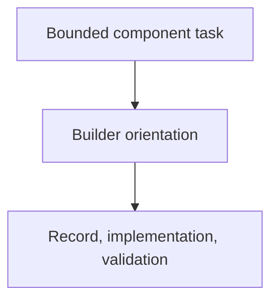

# component-builder Orientation

## Purpose

The component-builder builds one bounded component and manages its as-is.md
record. To start fast, it needs current repository task state in one call
rather than burning five-to-seven orientation turns reading records, the change
log, and specs. An orientation script provides that snapshot; the agent keeps
judgment over when to call it ("if needed").

## Diagram

## Links

- `changelog.md` — concise completed-task history.
