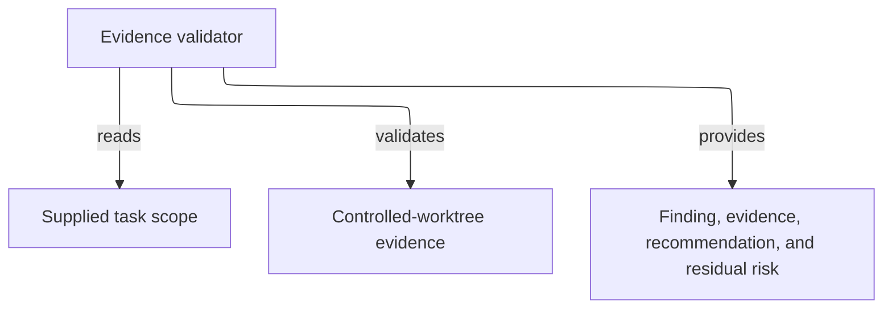

# evidence-validator - as-is

## Purpose

Perform bounded, read-only validation of supplied controlled-worktree evidence and determine whether a plan or implementation is safe to proceed or commit.

## Design

The validator inspects the applicable task record, supplied task scope, and bounded controlled-worktree Git evidence, then returns a finding, observed evidence, the smallest safe next action, and residual risk. It does not edit, execute arbitrary commands, delegate, commit, or grant task authority.

[as-is](../../as-is.md#design) / [agents](../as-is.md#design) / **evidence-validator**

- Pre-render layout plan: Use the Markdown Mermaid render surface with no fixed dimensions; use a TB/ELK progression for 4 visible nodes and 3 edges, keeping the validator, supplied scope, evidence, and report as a sparse linear route. Route downward with no additional grouping needed; rendered geometry and label fit remain untested because no local renderer is configured.

### Controlled-worktree validation boundary

The role is a validation boundary rather than an implementation worker. Its fixed inspection profile keeps evidence review separate from the builder's implementation authority.

## Links

- [`agent.md`](agent.md) — canonical role contract and inspection limits.
