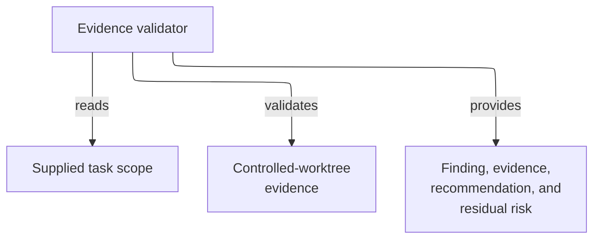

# evidence-validator - as-is

## Purpose

Perform bounded, read-only validation of supplied controlled-worktree evidence and determine whether a plan or implementation is safe to proceed or commit.

## Design

The validator inspects the applicable task record, supplied task scope, and bounded controlled-worktree Git evidence, then returns a finding, observed evidence, the smallest safe next action, and residual risk. Its fixed `focused_check` capability collects code-owned, parameterless evidence from the declared local suite; it is not arbitrary command execution and accepts no caller-selected command, path, argument, environment, or authority. The validator does not edit, delegate, commit, or grant task authority.

**Lineage**: [as-is](../../as-is.md#design) / [agents](../as-is.md#design) / **evidence-validator**

### Controlled-worktree validation boundary

The role is a validation boundary rather than an implementation worker. Its fixed inspection profile, including the parameterless code-owned `focused_check`, keeps evidence review separate from the builder's implementation authority; the focused check reports bounded evidence and grants no execution, mutation, task, delegation, commit, or completion authority.

## Links

- [`agent.md`](agent.md) — canonical role contract and inspection limits.
