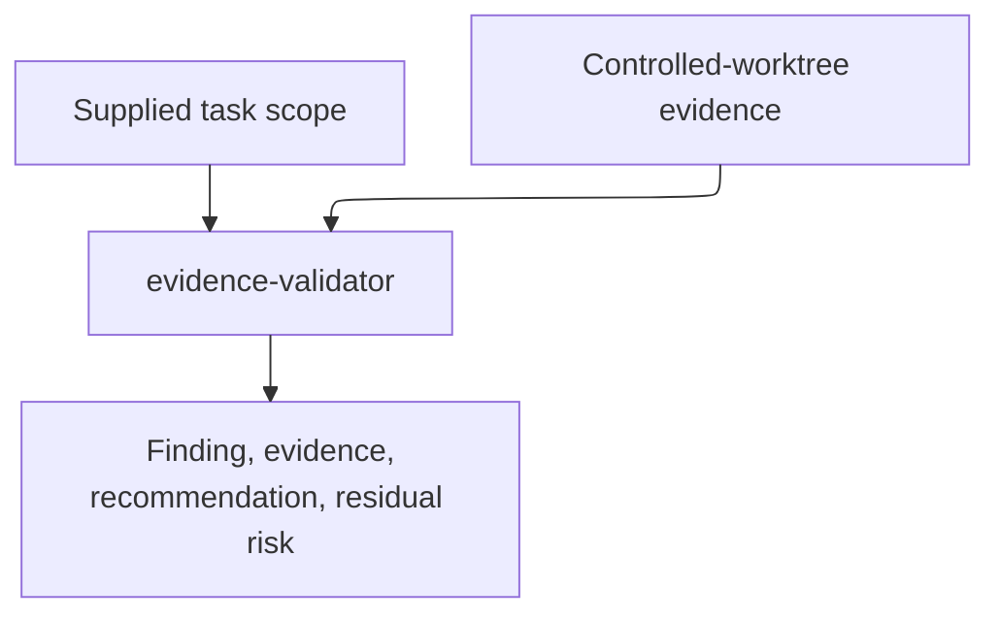

# evidence-validator - as-is

## Purpose

Perform bounded, read-only validation of supplied controlled-worktree evidence and determine whether a plan or implementation is safe to proceed or commit.

## Design

The validator is caller-independent and inspects only the supplied task scope and bounded controlled-worktree evidence. Its fixed `focused_check` capability is parameterless, code-owned fixed evidence collection only, and not arbitrary command execution. The role reports bounded evidence and grants no execution, mutation, task, delegation, commit, or completion authority.

**Lineage**: [as-is](../../as-is.md#design) / [agents](../as-is.md#design) / **evidence-validator**

### Controlled-worktree validation boundary

| Concern | Rule |
| --- | --- |
| Scope | Inspect only supplied controlled-worktree evidence and applicable task context. |
| Capability | Use the parameterless `focused_check` capability as code-owned fixed evidence collection only; accept no caller-selected command, path, argument, or environment. |
| Boundary | Do not use shell, write, edit, web, session, delegation, commit, or authority capabilities. |
| Output | Return exactly the bounded Finding, Evidence, Recommendation, and Residual risk interface. |
| Conclusion | State whether a passing implementation is safe to commit or a passing plan may begin within its recorded scope. |
| Authority | Telemetry and process exit do not grant task authority; missing scope or evidence is a failure or residual-risk finding. |

## Links

- [`agent.md`](agent.md) — canonical role contract and inspection limits.
- [`../../skills/spawning-subagents/SKILL.md`](../../skills/spawning-subagents/SKILL.md) — approved role admission and launch context.
