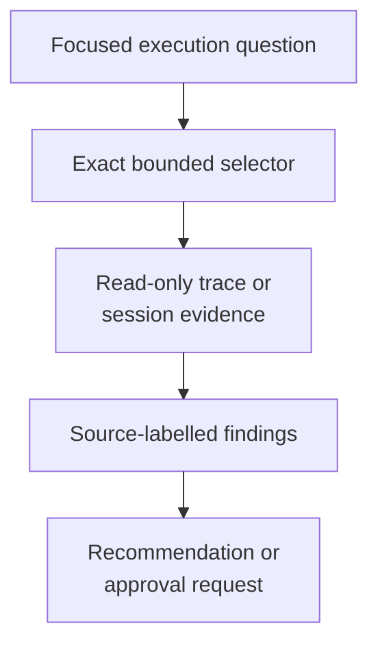

# execution-advisor - as-is

## Purpose

Analyze one bounded execution question using readable local traces or Pi session data, distinguish evidence from inference, and recommend process or budget actions without owning execution or budget authority.

## Design

The advisor requires a canonical scope, focused question, exact bounded selector, and current budget context. It reads only the evidence needed for the question and returns source-labelled observations, inferences, unknowns, recommendations, and approval-required budget requests.

**Lineage**: [as-is](../../as-is.md#design) / [agents](../as-is.md#design) / **execution-advisor**

### Bounded execution-evidence analysis

| Concern | Rule |
| --- | --- |
| Evidence | Use only the exact selector and smallest trace or session slice needed. |
| Separation | Distinguish observed facts, inferences, unknowns, recommendations, and approval requests. |
| Budget | Any extension is recommendation-only and must remain `approvalRequired: true`; never approve or apply a budget change. |
| Authority | Do not mutate task records, budgets, traces, sessions, configuration, processes, or completion state; do not launch or delegate. |
| Stop | Stop with insufficient evidence when scope, selector, attribution, or budget context is missing. |
| Runtime | The detached supervisor and control plane own process, wall-clock, and budget enforcement. |

## Links

- [`agent.md`](agent.md) — canonical advisory contract.
- [`../../skills/inspecting-execution-evidence/SKILL.md`](../../skills/inspecting-execution-evidence/SKILL.md) — bounded evidence inspection.
- [`../../skills/building-context/SKILL.md`](../../skills/building-context/SKILL.md) — bounded context assembly.
