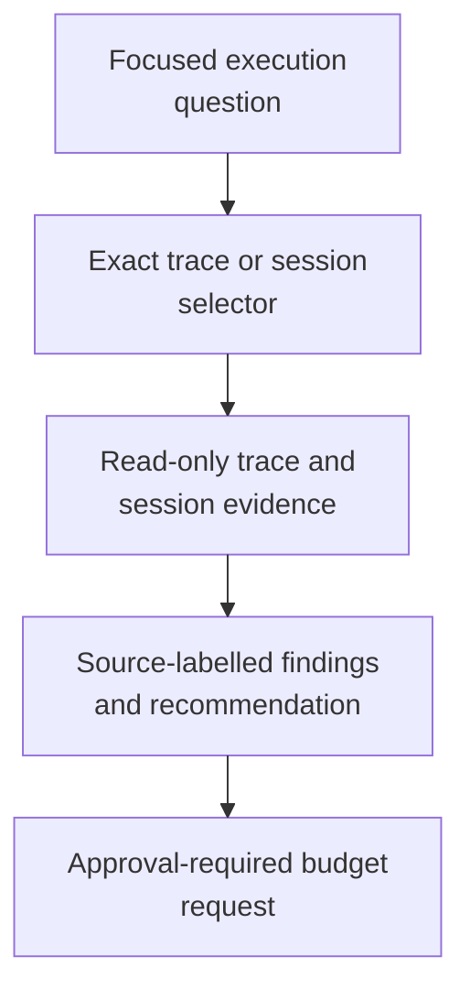

# execution-advisor - as-is

## Purpose

Analyze execution traces and readable local Pi session data to identify
execution issues, process-improvement opportunities, and justified time or
money budget-extension requests when an otherwise sound direction is blocked
by its current budget.

## Design

The advisor turns one bounded execution question and exact selector into source-labelled findings without acquiring runtime or budget authority.

**Lineage**: [as-is](../../as-is.md#design) / [agents](../as-is.md#design) / **execution-advisor**

### Bounded execution evidence analysis

| Concern | Rule |
| --- | --- |
| Evidence source | Use trace queries and an exact-ID, read-only, selector-driven session-analysis surface. |
| Output | Return source-labelled observations, inferences, unknowns, recommendations, and approval requests when justified. |
| Retrieval scope | Retrieve only the session detail needed for the investigation. |
| Role authority | The advisor cannot mutate task records, budgets, traces, sessions, configuration, processes, or completion state; launch or delegate agents; or authorize spending. |
| Budget extension | The control plane and user approval must durably authorize any extension. |
| Runtime ownership | The detached supervisor owns process ownership, wall-clock enforcement, and runtime reconciliation. |
## Links

- [`agent.md`](agent.md) — canonical role contract.
- [`../../skills/reusable/inspecting-execution-evidence/SKILL.md`](../../skills/reusable/inspecting-execution-evidence/SKILL.md) — bounded execution evidence procedure (baseline `exploring-execution-evidence` retired at F7; the adopted master counterpart `master/exploring-execution-evidence` remains live side-by-side until F9).
- [`../../core/contracts/component-task-record-protocol.md`](../../core/contracts/component-task-record-protocol.md) — task metadata, budget, recovery, and observation authority.
- [`../../core/contracts/execution-contract.md`](../../core/contracts/execution-contract.md) — host-neutral execution boundary.
- [`../../core/modules/observability/tracing-design.md`](../../core/modules/observability/tracing-design.md) — session-reference-first policy.
