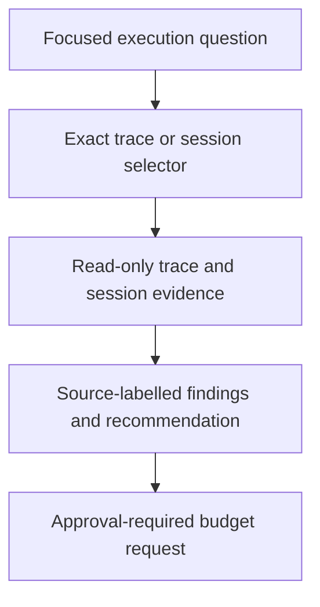

# execution-advisor - as-is

## Purpose

Analyze execution traces and readable local Pi session data to identify
execution issues, process-improvement opportunities, and justified time or
money budget-extension requests when an otherwise sound direction is blocked
by its current budget.

## Design

The advisor turns one bounded execution question and exact selector into source-labelled findings without acquiring runtime or budget authority.

[as-is](../../as-is.md#design) / [agents](../as-is.md#design) / **execution-advisor**

- Pre-render layout plan: Use the Markdown Mermaid render surface with no fixed dimensions; use a TB/ELK progression for 4 visible nodes and 3 edges, keeping the question-to-selector-to-evidence-to-findings/request route sparse and sequential. Route downward without extra grouping; rendered geometry and label fit remain untested because no local renderer is configured.

### Bounded execution evidence analysis

The role composes the globally available `exploring-execution-evidence` procedure and read-only task-record context. It uses trace queries and an exact-ID, read-only, selector-driven session-analysis surface, then returns source-labelled observations, inferences, unknowns, recommendations, and approval requests when justified. It retrieves only the session detail needed for the investigation.

## Authority And Boundaries

The role is an advisor, not the runtime supervisor. It cannot mutate task
records, budgets, traces, sessions, configuration, processes, or completion
state; launch or delegate agents; or authorize spending. The control plane and
user approval must durably authorize any budget extension. The detached
supervisor remains responsible for process ownership, wall-clock enforcement,
and runtime reconciliation.

## Links

- [`agent.md`](agent.md) — canonical role contract.
- [`../../skills/exploring-execution-evidence/SKILL.md`](../../skills/exploring-execution-evidence/SKILL.md) — bounded execution evidence procedure.
- [`../../docs/component-task-record-protocol.md`](../../docs/component-task-record-protocol.md) — task and budget authority.
- [`../../docs/execution-contract.md`](../../docs/execution-contract.md) — host-neutral execution boundary.
- [`../../components/observability/tracing-design.md`](../../components/observability/tracing-design.md) — session-reference-first policy.
