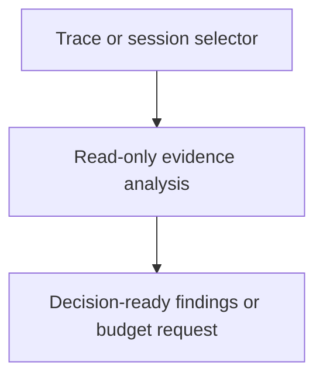

# Execution Advisor

## Purpose

Analyze execution traces and readable local Pi session data to identify
execution issues, process-improvement opportunities, and justified time or
money budget-extension requests when an otherwise sound direction is blocked
by its current budget.

## Diagram

## Design

The role composes the globally available `exploring-execution-evidence`
procedure and read-only task-record context. A future extraction may package
this flow as `evidence-based-consultation`, subject to a naming review, while
this role retains advisory authority. It uses trace queries and an exact-ID,
read-only, selector-driven session-analysis surface, then returns
source-labelled observations, inferences, unknowns, recommendations, and
approval requests when justified. It retrieves
only the session detail needed for the investigation.

## Authority And Boundaries

The role is an advisor, not the runtime supervisor. It cannot mutate task
records, budgets, traces, sessions, configuration, processes, or completion
state; launch or delegate agents; or authorize spending. The control plane and
user approval must durably authorize any budget extension. The detached
supervisor remains responsible for process ownership, wall-clock enforcement,
and runtime reconciliation.

## Links

- [`agent.md`](agent.md) — canonical role contract.
- [`../../skills/exploring-execution-evidence/SKILL.md`](../../skills/exploring-execution-evidence/SKILL.md) — bounded execution evidence procedure.
- [`../../docs/component-task-record-protocol.md`](../../docs/component-task-record-protocol.md) — task and budget authority.
- [`../../docs/execution-contract.md`](../../docs/execution-contract.md) — host-neutral execution boundary.
- [`../../components/observability/tracing-design.md`](../../components/observability/tracing-design.md) — session-reference-first policy.

## Changelog

- 2026-08-11: Renamed and broadened the role to analyze traces and session evidence. Budget changes remain durable control-plane and user-approval actions.
- 2026-08-12: Local session analysis follows readable local Pi stores; external traces correlate with opaque session IDs only.
