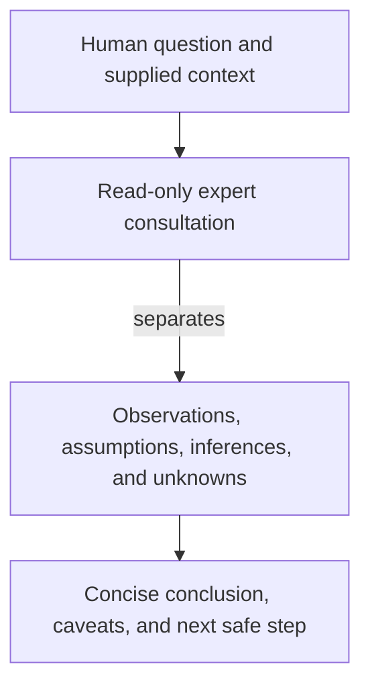

# expert - as-is

## Purpose

Provide bounded, read-only cross-domain analysis and a second perspective for human questions and required implementation reviews.

## Design

The expert reads the supplied context, separates observations from inference, and returns a concise advisory conclusion with limitations. It does not edit files, mutate task authority, delegate, launch work, or commit.

[as-is](../../as-is.md#design) / [agents](../as-is.md#design) / **expert**

- Pre-render layout plan: Use the Markdown Mermaid render surface with no fixed dimensions; use a TB/ELK progression for 4 visible nodes and 3 edges, keeping question, consultation, analysis, and conclusion as a sparse route. Route downward and group the analysis concerns within the consultation progression; rendered geometry and label fit remain untested because no local renderer is configured.

### Bounded second perspective

The role is independently selectable and is used for deeper consultation when uncertainty or review risk warrants another perspective. Its read-only contract is enforced by its declared tool and permission profile.

## Links

- [`agent.md`](agent.md) — canonical role contract and read-only capability boundary.
- [`../../skills/human-centered-consulting/SKILL.md`](../../skills/human-centered-consulting/SKILL.md) — consultation procedure.
