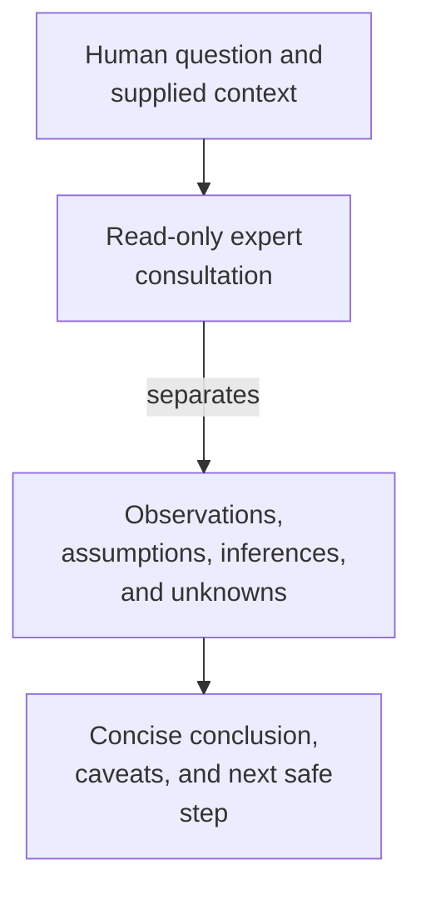

# expert - as-is

## Purpose

Provide bounded, read-only cross-domain analysis and a second perspective for human questions and required implementation reviews.

## Design

The expert reads the supplied context, separates observations from inference, and returns a concise advisory conclusion with limitations. It does not edit files, mutate task authority, delegate, launch work, or commit.

**Lineage**: [as-is](../../as-is.md#design) / [agents](../as-is.md#design) / **expert**

### Bounded second perspective

The role is independently selectable and is used for deeper consultation when uncertainty or review risk warrants another perspective. Its read-only contract is enforced by its declared tool and permission profile.

## Links

- [`agent.md`](agent.md) — canonical role contract and read-only capability boundary.
- [`../../skills/master/consulting-humans/SKILL.md`](../../skills/master/consulting-humans/SKILL.md) — consultation procedure.
