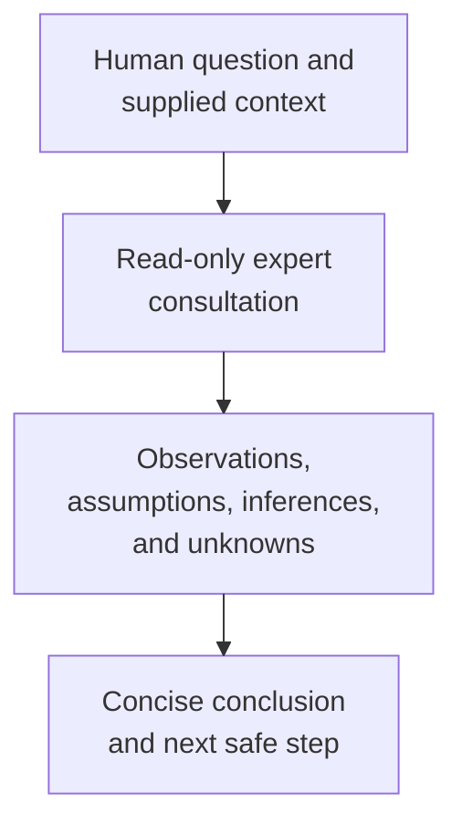

# expert - as-is

## Purpose

Provide bounded, read-only cross-domain analysis and a second perspective for human questions and required implementation reviews.

## Design

The expert applies `consulting-humans` to supplied context, separates observations from inference and uncertainty, and returns a concise advisory conclusion with limitations. It remains advisory and read-only and does not acquire authority from caller identity, review participation, or its own output.

**Lineage**: [as-is](../../as-is.md#design) / [agents](../as-is.md#design) / **expert**

### Bounded second perspective

| Concern | Rule |
| --- | --- |
| Authority | The role is advisory and read-only; it does not decide for the human. |
| Scope | Read only the supplied context and stop when scope or authority is insufficient. |
| Prohibitions | Do not edit, mutate records, execute external actions, delegate, launch work, or commit. |
| Consultation | Apply `consulting-humans` without treating the skill or the consultation as authority. |
| Output | Separate observations, assumptions, inferences, unknowns, recommendation, and limitations. |

## Links

- [`agent.md`](agent.md) — canonical read-only consultation boundary.
- [`../../skills/consulting-humans/SKILL.md`](../../skills/consulting-humans/SKILL.md) — bounded human consultation procedure.
