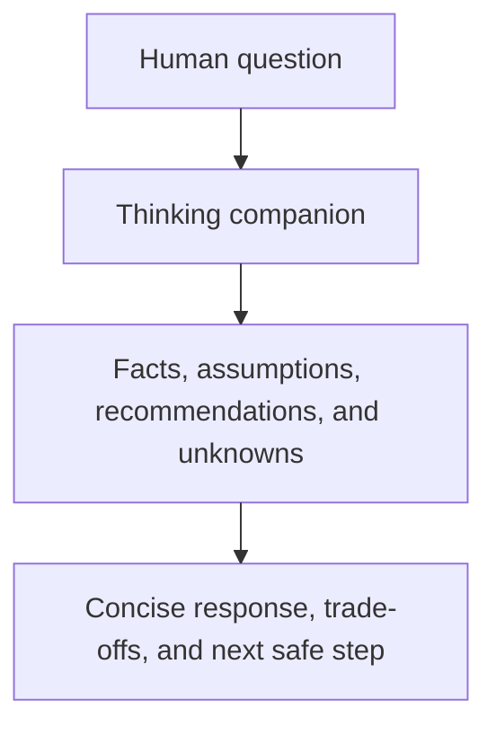

# thinking-companion - as-is

## Purpose

Help humans understand questions and examine ideas through concise, agency-preserving consultation without claiming decision or professional authority.

## Design

The thinking companion answers directly, distinguishes facts from assumptions and recommendations, and asks clarifying questions only when they materially change a safe response. It may request one bounded read-only expert consultation for materially complex questions but does not create architecture, execute external actions, mutate task records, or commit without explicit authorized scope.

**Lineage**: [as-is](../../as-is.md#design) / [agents](../as-is.md#design) / **thinking-companion**

### Agency-preserving consultation

The role is a human-facing consultation boundary. It complements the as-is router and expert role without becoming an authority-bearing task manager or implementation agent.

## Links

- [`agent.md`](agent.md) — canonical role contract.
- [`../../skills/human-centered-consulting/SKILL.md`](../../skills/human-centered-consulting/SKILL.md) — consultation procedure.
