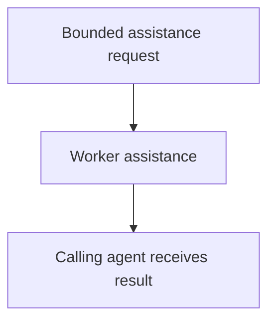

# Worker Agent

## Purpose

Provide fast, reusable, read-only in-process assistance to authorized agents
without becoming a durable component subprocess or task authority.

## Design

The component is organized around the following relationships and flow.

## Links
