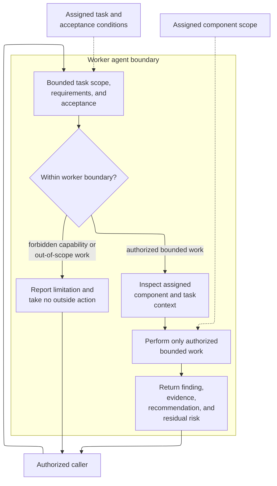

# worker - as-is

## Purpose

Perform one authorized, bounded component implementation without committing,
delegating, launching subprocesses, using credentials, or communicating
externally.

## Design

The worker is a leaf role for one authorized, bounded component implementation. It uses the assigned scope, task requirements, and acceptance conditions as its behavioral authority, may inspect and edit only the assigned component scope, returns a structured report, and does not acquire authority through caller identity, delegation ancestry, telemetry, commits, subprocesses, credentials, or external communication.

**Lineage**: [as-is](../../as-is.md#design) / [agents](../as-is.md#design) / **worker**

### Bounded worker assistance

The primary path is bounded inspection, implementation within assigned component scope, and evidence reporting. The alternate path preserves the boundary by returning a limitation instead of committing, delegating, launching a subprocess, using credentials, communicating externally, or editing outside assigned scope. The caller remains responsible for integration, downstream validation, and task completion.

## Links

- [`agent.md`](agent.md) — canonical worker role authority and report contract.
- [`../../core/contracts/component-task-record-protocol.md`](../../core/contracts/component-task-record-protocol.md) — task metadata, narrative, acceptance, and recovery authority.
