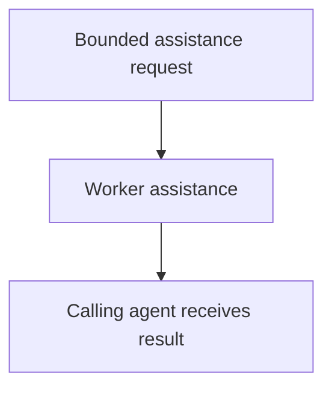

# Worker Agent

## Purpose

Provide fast, reusable, read-only in-process assistance to user-facing and
orchestrating agents without using a durable component subprocess.

## Diagram

## Links

- `changelog.md` — concise completed-task history.
