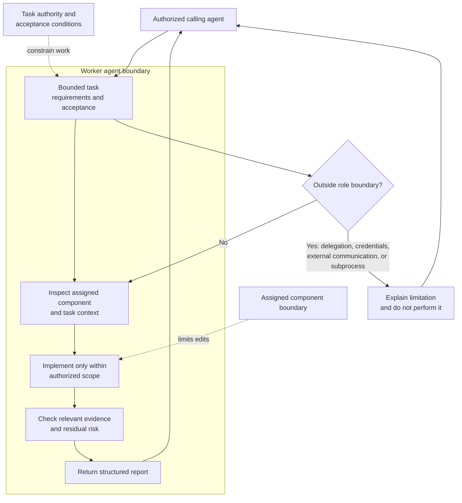

# Worker Agent

## Purpose

Provide fast, reusable, read-only in-process assistance to authorized agents
without becoming a durable component subprocess or task authority.

## Design

The worker performs one authorized, bounded implementation task in the assigned
component. It may inspect context and edit that scope, but it does not acquire
additional authority through delegation, commits, subprocesses, or external
communication. Its result is a concise report for the calling agent.

The primary path is bounded inspection, implementation, evidence checking, and
reporting. The alternate path preserves the boundary by returning a limitation
instead of delegating, launching a subprocess, committing, or contacting an
external service. The calling agent remains responsible for any downstream
review, integration, and task completion decision.

## Links
