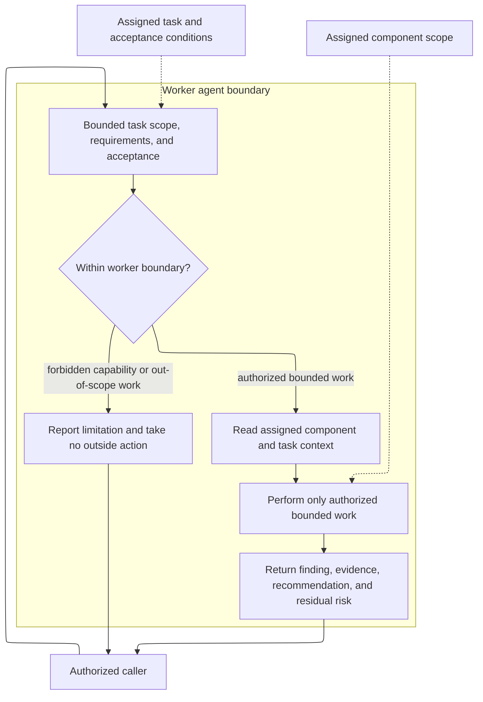

# worker - as-is

## Purpose

Provide fast, reusable, read-only in-process assistance to authorized agents
without becoming a durable component subprocess or task authority.

## Design

The worker is a leaf role for one authorized, bounded assistance request. It uses the assigned scope, task requirements, and acceptance conditions as its behavioral authority, returns a structured report, and does not acquire authority through caller identity, delegation ancestry, telemetry, commits, subprocesses, credentials, or external communication.

[as-is](../../as-is.md#design) / [agents](../as-is.md#design) / **worker**

### Bounded worker assistance

The primary path is bounded inspection, work, and evidence reporting. The alternate path preserves the boundary by returning a limitation instead of committing, delegating, launching a subprocess, using credentials, or communicating externally. The admitted capabilities determine what the work step can do; the current live-tested profile is read-only. The caller remains responsible for integration, downstream validation, and task completion.

## Links

- [`agent.md`](agent.md) — canonical worker role authority and report contract.
- [`../../docs/component-task-record-protocol.md`](../../docs/component-task-record-protocol.md) — durable task and acceptance authority.
