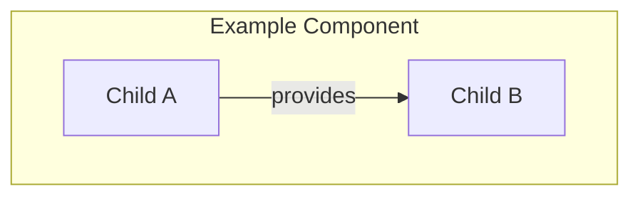
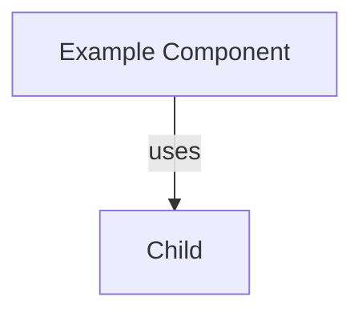

# `as-is.md` Documentation Improvements

## Status

The former improvement plan has been dissolved into the owning setup,
record-management, Mermaid, and naming skills. Current requirements belong to
those owners and their backlogs; this file is retained temporarily as a
migration index so its section-level history is not mistaken for current
authority.

## Current owners

- [`as-is-setup`](skills/as-is-setup/SKILL.md) — project adoption, candidate
  identification, human approval, and root instruction integration.
- [`managing-as-is-document`](skills/managing-as-is-document/SKILL.md) —
  individual record structure, parent navigation, structural diagrams, and
  as-is-specific view conventions.
- [`diagram-examples.md`](skills/managing-as-is-document/diagram-examples.md) —
  examples for the supported structural, context, scenario, data, state,
  decision, recovery, and journey views.
- [`designing-mermaid-diagrams`](skills/designing-mermaid-diagrams/SKILL.md) —
  generic Mermaid mechanics and type selection.
- [`naming-software-concepts`](skills/naming-software-concepts/SKILL.md) —
  semantic component and artifact naming.

This migration index is not a second source of truth.

## Purpose

This note records the migration context retained from the former planning
conversation. It is not an authoritative component record.

It also distinguishes three concerns: `as-is-setup` introduces the convention
into an existing project and injects the canonical-use instruction into the
root instruction file; `managing-as-is-document` creates and maintains
individual records; and `designing-mermaid-diagrams` provides generic Mermaid
diagram mechanics. As-is-specific record and container-diagram rules belong to
`managing-as-is-document` rather than the generic Mermaid skill.

## Component boundary

An `as-is.md` record does not need a separate `## Boundary` section merely to
define the component. The component is defined by the directory containing the
record. Descendants remain within that component until a descendant has its own
`as-is.md` record.

Boundary prose is still appropriate when it explains a meaningful ownership,
access, trust, or authority distinction that cannot be understood from the
directory, purpose, components, or design. It should be placed in the smallest
relevant existing section rather than added as repetitive template content.

## Required improvements for component records

For each record, add only the sections that materially improve navigation and
understanding. The H1 title must use the component's actual name followed by
` - as-is`, for example `# Skills - as-is`.

- **Purpose** — the enduring responsibility of the directory component.
- **Components** — immediate child components only, each linked to its own
  `as-is.md` when such a record exists.
- **Design** — for parent components, a local box-oriented container diagram
  first; for non-parent records, the smallest useful overview flow when one is
  warranted.
- **Relationships** — parent, sibling, capability, or dependency relationships
  when they change interpretation.
- **Links** — direct implementation, design, test, or flow references needed to
  understand the component.

A leaf record should also make its leaf status clear when useful, for example:

```markdown
## Design

This is a leaf component; no independently documented child components are
currently defined.
```

Do not create child components solely because files, classes, or routines
exist. Create one when the responsibility is semantically meaningful and
sufficiently complex to benefit from its own purpose, relationships, flows,
and navigable context.

## Diagram requirements

### Structural diagrams

A structural diagram is required at the start of `## Design` for a parent
component: a component with one or more immediate child records, each with its
own `as-is.md`. The actual component name is the container title and immediate
children are nested inside as labeled boxes. Containment is expressed by the
nested boxes, not by a `contains` arrow. A non-parent collection of ordinary
documents, such as `designs/`, does not receive a container diagram.



Use lightweight box styling when it improves scanability. Do not use a heatmap
for hierarchy: it communicates intensity rather than containment or navigation.
A child record's reverse navigation to its parent should be a nearby Markdown
link, such as `Parent: [Example Component](as-is.md#design)`, rather than a
synthetic parent node or edge.

Do not expose hidden providers or distant descendants in a child view.
External and sibling connections belong at the nearest shared parent view.

### Key-flow diagrams

Keep detailed diagrams for key or complex flows. Standard behavior remains
hidden under its abstraction or component unless an exception, failure mode,
security implication, or other architectural consequence makes it important.

Use top-to-bottom flowcharts by default for temporal flows, pipelines,
decisions, recovery, and state views. Container relationship maps are an
explicit exception: use a balanced or evenly distributed arrangement so
sibling relationships are visible without implying sequence. Sequence diagrams
remain another intentional exception because their participants are
conventionally horizontal. Every non-containment relationship must have an
explicit, semantically labeled arrow.

Useful view metadata includes:

```markdown
## View

- Kind: `data-flow`
- Scope: `example-component`
- Visible levels: component and immediate children
- Layout: top-to-bottom
- Arrow meaning: data or result progression
```

## Linked component names

When a child component appears in a parent diagram, its displayed name should
link to the child's detailed diagram context, normally the `## Design` section
of its `as-is.md`, rather than only to the component directory route. Mermaid
source may use a resolvable `click` target or a renderer-supported linked node
label. Rendered SVG output must preserve the hyperlink where supported so
selecting a component opens its architecture details. Markdown component tables
should use the same target. A parent link in a child record is nearby Markdown
navigation, not a diagram node or edge.

Example intent:



The exact relative URL depends on the source record's directory and renderer.
A rendered SVG is a presentation artifact; the Markdown source and linked
record remain authoritative if a renderer cannot preserve a link.

## Key flows to add

A record needs a separate detailed flow when its behavior cannot be understood
from the overview diagram. Typical sections are:

- Trigger and preconditions.
- Participants at the selected hierarchy level.
- Ordered primary steps.
- Decisions and rejected paths.
- Failure, retry, cancellation, or recovery behavior when consequential.
- Completion or observable outcome.
- Assumed standard behavior hidden under components or abstractions.

Implementation details belong in linked leaf artifacts unless they affect a
visible architectural boundary or key flow.

## Candidate component identification

The integration skill should inspect an existing project semantically rather
than mechanically turning every directory, class, or module into a component.
Potential components include pieces with a distinct responsibility and enough
complexity or architectural consequence to justify independent documentation.
Evidence may include:

- A coherent user or system capability.
- A meaningful ownership or authority boundary.
- Multiple responsibilities that form a stable collaboration.
- Significant lifecycle, state, or failure behavior.
- Important external or sibling relationships.
- Independent change impact, testing scope, or operational concern.
- A key or complex flow that benefits from progressive disclosure.

The skill should record candidates and confidence or uncertainty, then create
or propose the smallest useful component record. Human design authority remains
responsible for accepting, merging, renaming, or rejecting candidates.

## Setup versus record maintenance

Project adoption should be handled by a dedicated setup/integration skill. Its
responsibilities include discovering the project root, proposing the initial
`as-is` layout, identifying semantically meaningful and sufficiently complex
components, creating an initial `components/` structure when that layout is
adopted, and producing a reviewable plan before making writes. It must preserve
existing project content and distinguish candidate discovery from architectural
approval.

The existing `components/as-is-setup` directory is an implementation component
with setup behavior; it is evidence and may support the future skill, but it is
not itself the reusable setup skill.

The setup skill remains responsible for project adoption and root instruction
integration. The record-management skill remains responsible for the lifecycle,
strict title, hierarchy, links, and as-is-specific diagrams of each individual
`as-is.md`. The Mermaid skill remains generic and does not own as-is conventions.

## Migration order

1. Add missing direct links to implementation, tests, and designs.
2. Mark whether each record is a leaf or has documented children.
3. Separate overview structure from key flows where the current diagram mixes
   them.
4. Add semantic relationship labels and explicit arrows.
5. Add component-name links to target `#design` anchors and validate rendered
   SVG hyperlinks.
6. Expand only the records whose complexity or architectural consequence
   warrants additional detail.

## Completion checks

- The directory, not a redundant section, defines component scope.
- Parent component diagrams are bounded to the component and immediate
  children; non-parent records do not receive container diagrams.
- Container diagrams use the actual component title and nested boxes; other
  relationships use explicit labeled arrows.
- Standard flows are not repeated unnecessarily.
- Key flows include consequential outcomes and failure paths.
- Component names navigate to target diagram sections in source and rendered
  output where supported.
- Direct Markdown links resolve and `git diff --check` passes.
