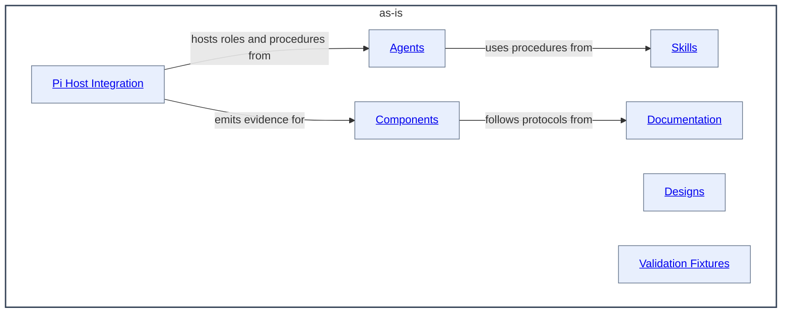

# as-is - as-is

## Purpose

Own the repository-wide composition model and provide the top-level map of its
agent roles, reusable skills, implemented components, design documents, and
validation fixtures. This record is durable shared context for both human
readers and agents: humans use it to review the architecture, and agents use it
to orient within the repository. It does not replace the records owned by the
areas it maps.

## Components

The root component lists only its immediate documented component children.
Deeper descendants are linked by their immediate parent rather than by this
record.

| Component | Purpose |
| --- | --- |
| [Agents](agents/as-is.md#design) | Organize independent configured agent roles. |
| [Designs](designs/as-is.md#design) | Organize enduring architecture and execution designs. |
| [Skills](skills/as-is.md#design) | Organize reusable operational procedures. |
| [Components](components/as-is.md#design) | Organize implementation boundaries and their focused tests. |
| [Documentation](docs/as-is.md#design) | Organize normative repository protocols and guidance. |
| [Validation Fixtures](validation-fixtures/as-is.md#design) | Organize retained delegation, adapter, and recovery evidence. |
| [Pi Host Integration](.pi/as-is.md#design) | Map repository contracts onto the local Pi host. |

## Design

This is a component map, not a mandatory execution sequence. The root record
connects the repository component to its immediate documented child areas.

Parent: [as-is](#design)

The repository's composition model separates authority-bearing agents and workflows from reusable skills. Agents and workflows compose the child areas; explicit links and each area's Design section provide the bounded context for their relationships.

If the host Markdown renderer suppresses Mermaid navigation, use these
source-level links, which remain authoritative:

- [Open Agents design](agents/as-is.md#design)
- [Open Designs design](designs/as-is.md#design)
- [Open Skills design](skills/as-is.md#design)
- [Open Components design](components/as-is.md#design)
- [Open Documentation design](docs/as-is.md#design)
- [Open Validation Fixtures design](validation-fixtures/as-is.md#design)
- [Open Pi Host Integration design](.pi/as-is.md#design)

Only areas with their own `as-is.md` are components in this record. Other
repository directories remain navigable through their own files or links but
are not listed as components here. `docs/` is a documented collection rather
than a set of child components, while `.pi/` is a host-integration boundary;
`.opencode/`, `scripts/`, `temp/`, and `.agents/` remain ordinary or projected
artifacts without independent records.

- The repository is composed of filesystem areas and components with durable
  `as-is.md` records.
- This root record maps immediate areas; each area owns the detailed records for
  its descendants.
- Explicit links provide bounded context; parent context is never ambient.
- Machine configuration belongs in `as-is.json`, and active task state belongs
  in the configured task record.

## Links

- [`docs/design-principles.md`](docs/design-principles.md) — repository-wide authority and design principles.
- [`docs/configuration.md`](docs/configuration.md) — machine-configuration boundary.
