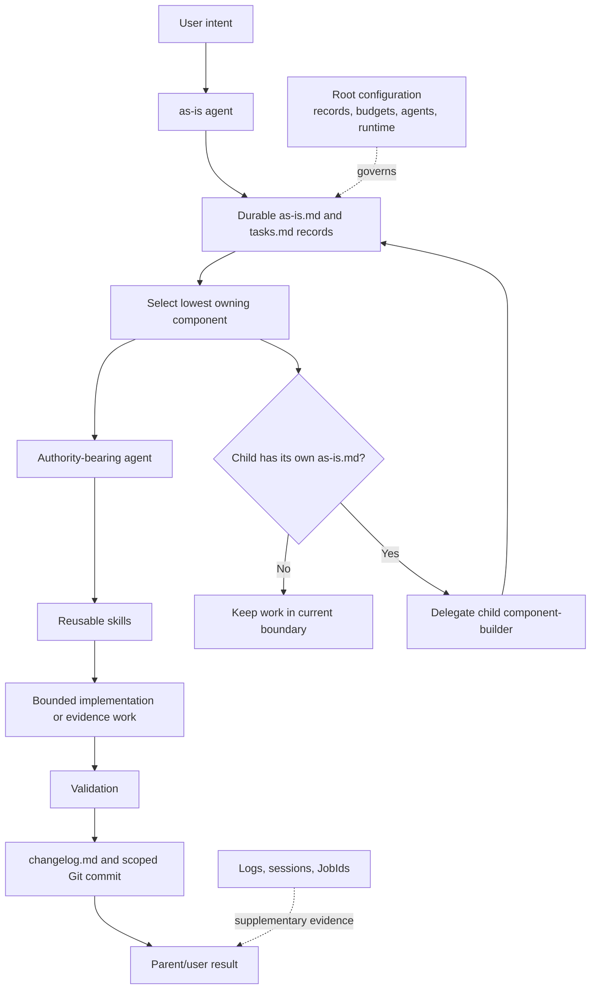

# as-is Project

## Purpose

Describe the repository-root component: its purpose, design, boundaries, and
links to relevant project artifacts. The root `as-is.md` is durable component
context, not a transient task record. Root changes use a transient `tasks.md` and
write their concise completed summary to `changelog.md`.

## Design

The repository is composed of filesystem components. Each `as-is.md` describes
one component's current purpose, design, boundary, and links. Durable records
hold project context and task state; agents hold authority; skills provide
reusable procedures; and host runtime artifacts provide observation only. A
component owns its directory and delegates work when a descendant has its own
`as-is.md` boundary.

## Structure

- `components/` — implemented project components.
- `docs/` — settled project contracts and documentation.
- `designs/` — designs awaiting implementation.
- `skills/` — reusable procedures that may modify system functionality.
- `validation-fixtures/` — retained validation and recovery evidence.
