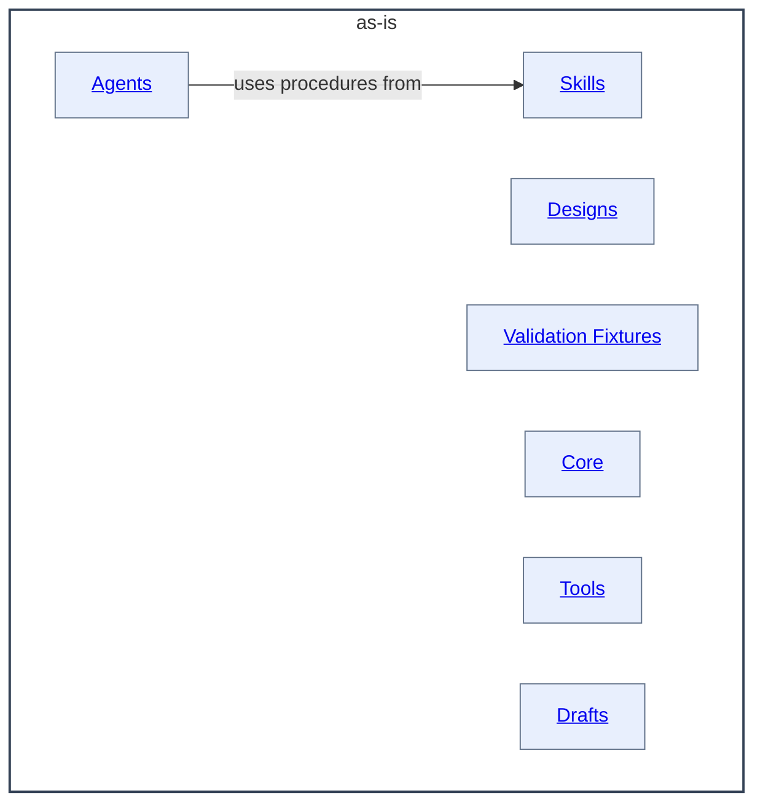

# as-is - as-is

## Purpose

Own the repository-wide composition model and provide the top-level map of its
agent roles, reusable skills, implemented components, design documents, and
validation fixtures. This record is durable shared context for both human
readers and agents: humans use it to review the architecture, and agents use it
to orient within the repository. It does not replace the records owned by the
areas it maps.

## Components

The root component lists only its immediate documented component children.
Deeper descendants are linked by their immediate parent rather than by this
record.

| Component | Purpose |
| --- | --- |
| [Agents](agents/as-is.md#design) | Organize independent configured agent roles. |
| [Designs](designs/as-is.md#design) | Organize enduring architecture and execution designs. |
| [Skills](skills/as-is.md#design) | Organize reusable operational procedures. |
| [Validation Fixtures](validation-fixtures/as-is.md#design) | Organize retained delegation, adapter, and recovery evidence. |
| [Core](core/as-is.md#design) | Organize approved host-neutral deterministic implementation families and adapters. |
| [Tools](tools/as-is.md#design) | Organize bounded agent-facing tool implementations. |
| [Drafts](drafts/as-is.md#design) | Preserve bounded proposals that are not yet current authority. |

## Design

This is a component map, not a mandatory execution sequence. The root record
connects the repository component to its immediate documented child areas.

**Lineage**: **as-is**

The repository's composition model separates authority-bearing agents from reusable skills and bounded tools. Roles select and apply skills and tools to produce workflows at runtime; explicit links and each area's Design section provide the bounded context for their relationships.

### Repository child relationship map

Only areas with their own `as-is.md` are components in this record. Other repository directories remain navigable through their own files or links but are not listed as components here. Root `design-principles.md` provides repository-wide principles; `core/contracts/` provides normative contract documents. `.pi/` remains a projected bundle artifact rather than canonical source. `.opencode/`, `scripts/`, `temp/`, and `.agents/` remain ordinary or projected artifacts without independent records.

- The repository is composed of filesystem areas and components with durable
  `as-is.md` records.
- This root record maps immediate areas; each area owns the detailed records for
  its descendants.
- The `.pi/` directory remains a projected bundle artifact rather than a canonical resource component; future host-integration policy remains in the aspirational architecture handoff and does not authorize projection.
- Explicit links provide bounded context; parent context is never ambient.
- Machine configuration belongs in `as-is.json`, and active task state belongs
  in the configured task record.

## Links

- [`design-principles.md`](design-principles.md) — repository-wide authority and design principles.
- [`core/contracts/architecture-vocabulary.md`](core/contracts/architecture-vocabulary.md#scope-and-authority) — shared current-system architecture definitions and authority boundary.
- [`core/contracts/index.md`](core/contracts/index.md) — normative task, configuration, and execution contract collection.
- [`core/contracts/configuration.md`](core/contracts/configuration.md) — generic configuration-data boundary; consumer defaults and namespaces remain with their owners.
