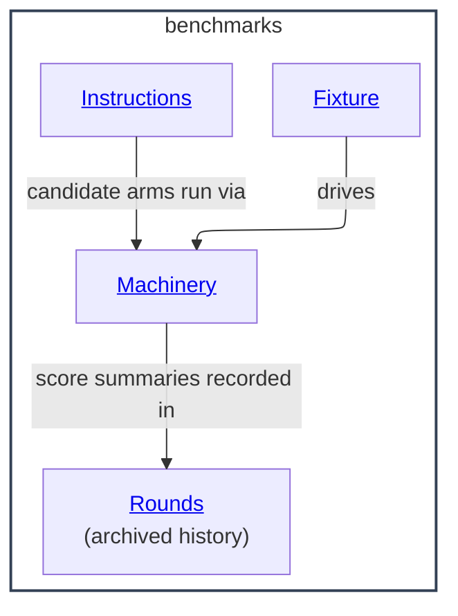

# benchmarks - as-is

## Purpose

Benchmark repository implementations on demand: run comparable arms through one fixture and one machinery, and compare deterministic scores and real costs.

## Components

| Component | Purpose |
| --- | --- |
| [Fixture](fixture/as-is.md#design) | QueueRelay F0-F5 phase contract; implemented by `machinery/phases.ts` and `machinery/seed.ts`. |
| [Machinery](machinery/as-is.md#design) | Arm runner: proxy with runner pinning and real cost capture, supervisor, deterministic 0-5 checkers, blind-assessment tooling. |
| [Instructions](instructions/as-is.md#design) | Frozen candidate instructions for candidate arms; B2 is the drop-in successor, v1 stays frozen because scored runs cite it by hash. |
| [Rounds](rounds/as-is.md#design) | Archived round history (QR1, QR2): decision packets, review trails, and score summaries. |

## Design

The setup measures one independent variable per comparison: what drives an arm is either the current composition (baseline arm, surface-snapshotted from the repo at run start) or one frozen candidate instruction (candidate arm). Runner model, fixture seed, phase driver, budgets, and checkers are machinery-owned and identical across arms. Results from different runner models are separate axes and are never pooled; runner identity is disclosed per run. The instruction author never blind-scores; the executing model never assesses. Instructions and checker logic are never edited mid-run; runner quirks are accommodated in machinery, equally for all arms. Cap exhaustion and boundary violations are scored outcomes, never hidden.

**Lineage**: [as-is](../as-is.md#design) / **benchmarks**

### Component relationships

### On-demand flow

Pick arms (baseline surface vs frozen instruction), optionally set `QR2_RUNNER_MODEL`, run `machinery/smoke.ts`, then `machinery/run-scored.ts baseline|candidate <fresh-outDir>` per arm; record scores and spend in a round record and summarize conclusions in `changelog.md`. Operating detail lives in the Machinery record.

### Retention
Round outputs and intermediate candidate drafts are not stored (human ruling, 2026-09-23); scores and spend survive in the Rounds record's round summaries and `changelog.md`. Credential-bearing `session-cfg` directories are excluded by rule. The component was established 2026-09-23 from `temp/` working state and restructured to this layout the same day; paths inside archived documents are historical, not current locations.

## Relationships

- Consumes model access through OpenRouter; any model id works, with cards derived from the OpenRouter models list (Machinery record).
- Measures candidates authored under [Drafts](../drafts/as-is.md#design) (`drafts/thin-portable-harness-instruction/`) and the frozen instructions here.
- Produces decision-grade evidence for [Docs](../docs/as-is.md#design) records and root planning; it does not authorize repository changes.

## Links

- Operating the setup: [machinery/README.md](machinery/README.md).
- Fixture and scoring contracts: [fixture/fixture-spec.md](fixture/fixture-spec.md), [process-spec.md](process-spec.md).
- Frozen instructions and freeze evidence: [instructions/](instructions/candidate-b2.md).
- Round conclusions: in the Rounds record; assessor ratings: `machinery/assessment/ratings/`.