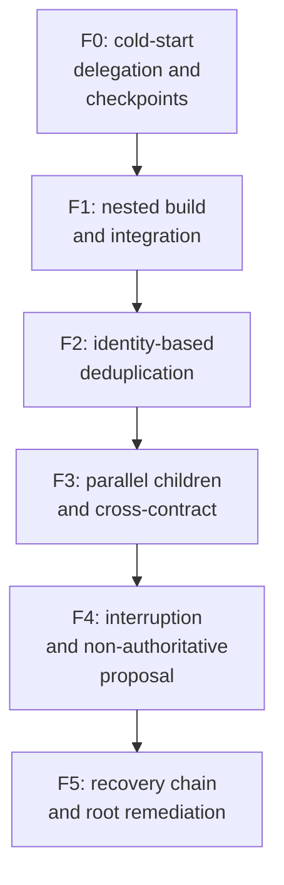

# fixture - as-is

## Purpose

Define the QueueRelay F0-F5 phase contract used by every benchmark arm: one fixture, one machinery, comparable scores.

## Design

The fixture specifies the five-phase progression from a cold-start integrity phase through nested delegation, deduplication, cross-component integration, and interruption-recovery to a final decision-and-remediation phase. Each phase has a deterministic acceptance contract and a 0-5 scoring rubric with a boundary-zero cap. Machinery implements the phases; the spec text is frozen by gate review so arm comparisons remain comparable across rounds and runner models.

**Lineage**: [as-is](../../as-is.md#design) / [benchmarks](../as-is.md#design) / **fixture**

### Phase progression

| Concern | Rule |
| --- | --- |
| Comparability | All arms run the same frozen phases, caps, and checkers; nothing is tuned per arm. |
| Authority | The spec is a benchmark contract; it grants no authority over the repository under test. |
| Scoring | Deterministic 0-5 per phase with boundary-zero cap; truthful FAILs are recorded as FAILs. |

## Links

- [`fixture-spec.md`](./fixture-spec.md#4-phase-progression) — the frozen phase contract and acceptance conditions.