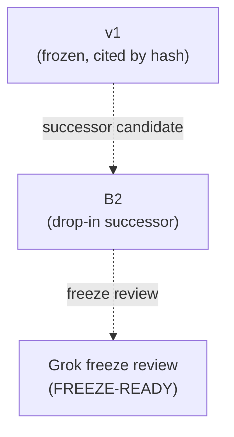

# instructions - as-is

## Purpose

Hold the frozen candidate instructions that arm benchmarks run: v1 stays frozen because scored runs cite it by hash; B2 is the drop-in successor candidate.

## Design

Each instruction is a self-contained, fixture-agnostic candidate that a runner executes unchanged. Instructions are frozen after review and cited by content hash in scored-run records; failed or superseded candidates are not deleted while scores referencing them remain meaningful. B2 added closure-ledger discipline and checkpoint gating on top of v1's boundary clauses. Instruction changes flow through the Sol-to-Grok review chain to a human freeze.

**Lineage**: [as-is](../../as-is.md#design) / [benchmarks](../as-is.md#design) / **instructions**

### Frozen candidates

| Concern | Rule |
| --- | --- |
| Immutability | A frozen instruction is never edited; a revision becomes a new candidate. |
| Citing | Scored runs record the instruction hash they executed. |
| Cap | Candidate text is capped (B2 cap: 10,000 bytes), verified externally. |

## Links

- [`candidate-v1.md`](candidate-v1.md) — frozen round-1 instruction.
- [`candidate-b2.md`](candidate-b2.md) — drop-in successor candidate.
- [`candidate-b2-grok-freeze-review.md`](candidate-b2-grok-freeze-review.md) — freeze review trail.