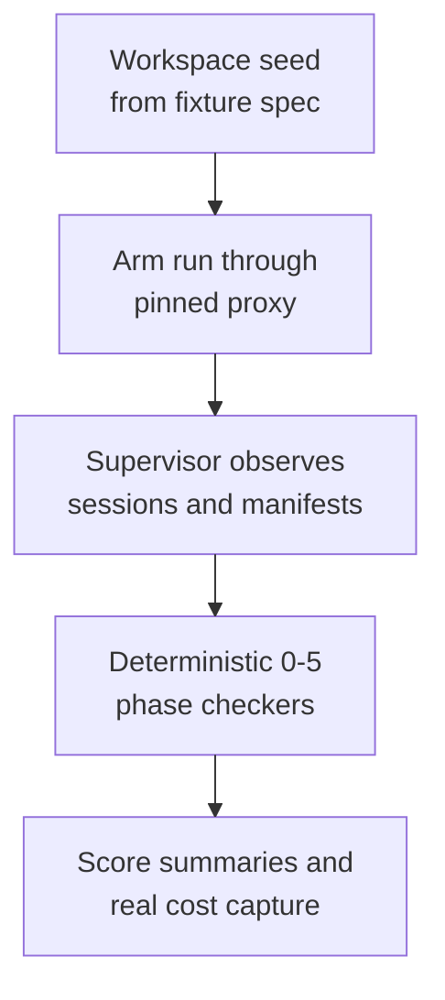

# machinery - as-is

## Purpose

Launch benchmark arms through one runner: proxy with runner pinning and real cost capture, supervisor, deterministic checkers, and blind-assessment tooling.

## Design

The machinery executes arms locally: an OpenAI-compatible proxy pins the runner model and captures per-session costs; the supervisor seeds workspaces, launches arms, and freezes manifests; deterministic 0-5 checkers score phases; assessment tooling builds blind packets and runs labeled assessors. Runner identity is disclosed per round; results from different runner models are separate axes and are never pooled. Runtime setup (pi-runtime host symlink) is documented in the README.

**Lineage**: [as-is](../../as-is.md#design) / [benchmarks](../as-is.md#design) / **machinery**

### Arm execution flow

| Concern | Rule |
| --- | --- |
| Equal machinery | Both arms run identical machinery, caps, and observation; only the instruction differs. |
| Cost truth | Proxy-captured costs are real OpenRouter spend; no estimates. |
| Custody | Run outputs and credentials stay out of the repository; session configs are excluded by rule. |
| No pooling | Scores from different runner models are recorded as separate axes. |

## Links

- [`README.md`](README.md) — runtime setup, entry points, runner-model configuration.