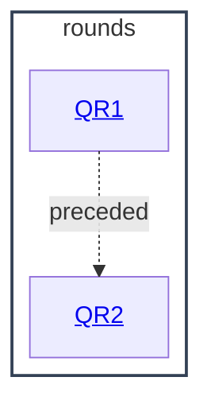

# rounds - as-is

## Purpose

Retain the completed benchmark rounds as archived history: the scored outcomes, review trails, and decision records that the reusable instrument produced.

## Components

| Component | Purpose |
| --- | --- |
| [QR1](qr1/as-is.md#design) | Round-1 history: minimal-vs-structured candidate comparison, final candidate instruction, review trail, worklog. |
| [QR2](qr2/as-is.md#design) | Round-2 history: governance process, capability accounting, decision packet, review trail, score summaries. |

## Design

Both rounds are closed archives of the same benchmarking instrument: round records hold process documents, decision packets, review trails, and score summaries, never runnable state. New rounds are added as sibling `qr<N>` directories here with their own canonical record, process document, and score summaries; they do not alter the reusable instrument at the component root. Per the retention ruling, scored-run outputs and intermediate candidate drafts are not stored; `session-cfg` credential directories are excluded by rule.

**Lineage**: [as-is](../../as-is.md#design) / [benchmarks](../as-is.md#design) / **rounds**

### Round archive map

## Links

- Round-2 conclusions: [qr2/decision-packet.md](qr2/decision-packet.md); score summaries: [qr2/process.json](qr2/process.json) (`scored_runs`, `b2_scored`, `glm_flash_experiment`).
- Round-1 worklog: [qr1/WORKLOG-post-freeze.md](qr1/WORKLOG-post-freeze.md).