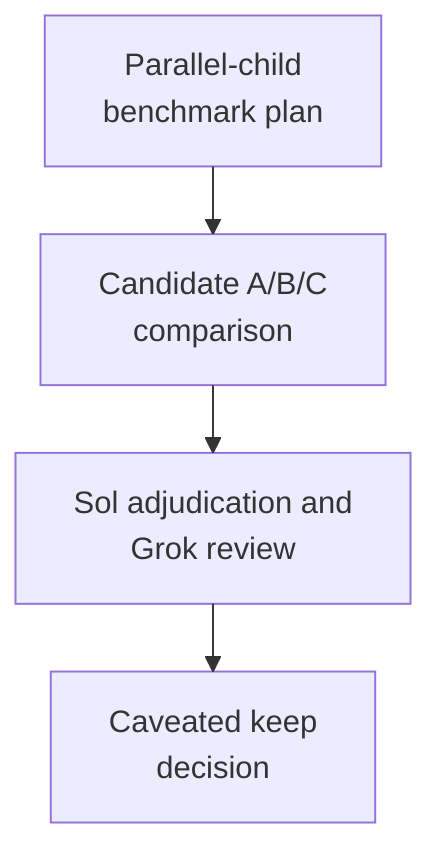

# qr1 - as-is

## Purpose

Round-1 history: minimal-vs-structured candidate comparison under the parallel-child benchmark, ending in a caveated keep decision.

## Design

Round 1 compared the current composition against thin candidates B and C using the parallel-child benchmark. The result was descriptive only: current composed machinery matched candidate capability while the temporal dimension remained unmeasured, and the round ended with caveats rather than a consolidation. The round's proposals, review trails, and adjudication artifacts are preserved here as archived evidence; paths inside them are historical, not current locations.

**Lineage**: [as-is](../../../as-is.md#design) / [benchmarks](../../as-is.md#design) / [rounds](../as-is.md#design) / **qr1**

### Round-1 flow

## Links

- [`WORKLOG-post-freeze.md`](WORKLOG-post-freeze.md) — round-1 worklog.
- [`thin-portable-harness-instruction-proposal.md`](thin-portable-harness-instruction-proposal.md) — origin proposal.
- [`validation.md`](validation.md) — round-1 validation record.