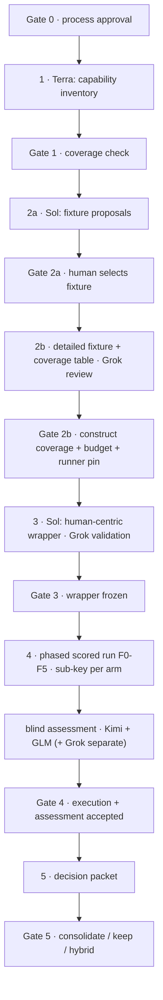

# Benchmark Round 2 — Process v3 (DRAFT for Gate 0 approval)

**Goal.** Determine whether a thin, portable, Sol-authored **human-centric design-first** instruction bundle preserves the current composition's capabilities — delegation, context/skills routing, recovery, and human-consumable design documentation — under a multi-phase fixture that *requires* them, producing a decision-grade packet for a consolidate / keep / hybrid decision.

**Base.** `temp/benchmark-round-2/`. Frozen round-1 material stays in `temp/benchmark-candidate-c/`.

## Corrections inherited from the human (2026-09-08)

- **One thin candidate, not two.** Round 1 already settled minimal-vs-structured (C's record discipline won). Round 2 runs **one** Sol-authored design-first candidate against the Current control. The candidate itself is not "human-centric" — its **design-document flow is**: it must produce succinct design documents with diagrams, fit for human consumption and authorization (not detailed design specs). During benchmarking no human reads them; blinded assessors rate human-consumability as proxies. Round-1 context: C originated from the human noticing a capability drop — the lack of exactly these documents; the round-2 capability table (step 1) must capture that.
- **Runner stays the preset.** Round-1 runner identity, per the human for reference: GPT 5.6 Luna (behind the opaque `@preset/abs-*` naming). Round 2 continues to use the preset — with one hard requirement: **session-level cost retrieval must be verified to work before execution** (each arm run tagged so its cost is recoverable from OpenRouter session data). Contingency if session costs prove unreadable: labeled per-run sub-keys (decided at Gate 2b, disclosed).

## Roles

| Role | Model | Duty | Constraint |
|---|---|---|---|
| Capability assessor | Terra | Step 1 inventory | Budget-capped (Gate 1a) |
| Protocol/fixture author | Sol | Steps 2–3; **decides the scoring approach** (constraint below is binding) | Author — never a blind scorer; labeled author-analysis only |
| Process/fixture/wrapper reviewer | Grok | Steps 2–3 validation; step 4 assessor | Role accumulation disclosed; scores reported separately from deciding median |
| Arm runner | `@preset/abs-*` (identity Luna, reference) | Step 4 execution | Identical for every arm; session-cost retrieval verified pre-execution |
| Assessors | Kimi, GLM 5.3, Grok | Step 4 scoring | **Scores kept at model level** — each model's ratings reported separately with its roles annotated, so the effect of each model's other duties on its scoring is analyzable; consolidation into a human-consumable view happens afterward (Sol's approach, human constraint: model-level preservation) |

## Fixture shape (the core round-2 design)

The fixture is **built in phases, and every phase is scored** — robustness across change types is the measured quantity:

| Phase | What the arm must do |
|---|---|
| F0 Base | Establish/understand the baseline system |
| F1 Additive extension | New feature into existing structure |
| F2 Corrective modification | Fix defective behavior without regressions |
| F3 Refactoring (feature preservation) | Restructure; behavior byte-stable |
| F4 Feature dropping (deletion) | Remove cleanly; no orphans, no over-deletion |
| F5 Complex extension | One task combining F1–F4 concerns |

Plus, after fixture creation: a **system capability coverage table** mapping every phase to the system capabilities it exercises (delegation, routing, recovery, human-doc production, …) — any capability with no phase is either cut from claims or the fixture grows. A **meta document** records that this flow is a template: it can be re-run against a larger fixture without redesign.

## Steps, outcomes, gates

| # | Step | Outcome (artifact) | Human gate |
|---|---|---|---|
| 0 | Approve this process | `PROCESS.md` + `process.json` | **Gate 0 — this document** |
| 1 | Terra inventories current-system capabilities (incl. the human-doc gap that motivated C) | `capability-inventory.md` (≤2 pages + matrix) | **Gate 1**: coverage check — what the fixture must require |
| 2a | Sol proposes **2–3 fixture concepts** with reasons | `fixture-proposals.md` (brief) | **Gate 2a**: human **selects the fixture** |
| 2b | Detailed fixture spec + phased build + capability coverage table + process spec (Sol; Grok review) | `fixture-spec.md`, `coverage-table.md`, `process-spec.md` | **Gate 2b**: construct coverage + budget sheet + **session-cost retrieval verified** |
| 3 | Sol authors the single human-centric design-first wrapper; Grok validates | `wrapper.md` + review verdict | **Gate 3**: wrapper frozen (hash-pinned) |
| 4 | Scored execution (per-phase scoring) + blinded assessment | per-arm per-phase results, checker verdicts, blinded packets, ratings | **Gate 4**: execution authorized (spend ceiling binding) |
| 5 | Decision packet | `decision-packet.md` (≤3 pages, diagrams) + machine twins | **Gate 5**: consolidate / keep / hybrid |

## Controls carried forward / fixed

- Telemetry: bridge file-op reporting → temporal + per-phase chronology determinate.
- Cost: preset runner with per-run session tags; **session-level cost retrieval verified before Gate 4**; ledger vs actuals reconciled. Contingency: labeled sub-keys.
- Assessment: blinded packets (no labels/cost/latency); wrapper doc-quality rated for human-consumability (succinctness, diagrams, decision-readiness); **per-model scoring with roles annotated**; Sol decides the scoring approach — human constraint: scores preserved at model level, consolidated only for human consumption.
- Reporting: descriptive only; no pooling with round 1; truthful failures always reported.
- Custody: every human artifact has a machine-readable twin; everything in this folder.

## Open questions (for Gate 0)

1. Confirm: single thin candidate + Current control (ablation dropped)?
2. Accept Sol deciding the scoring approach (model-level scores, consolidated for human consumption)?
3. Accept Grok's three disclosed roles (scores reported at model level, separately)?
4. Per-phase scoring weights: Sol's call within the model-level constraint?

---

