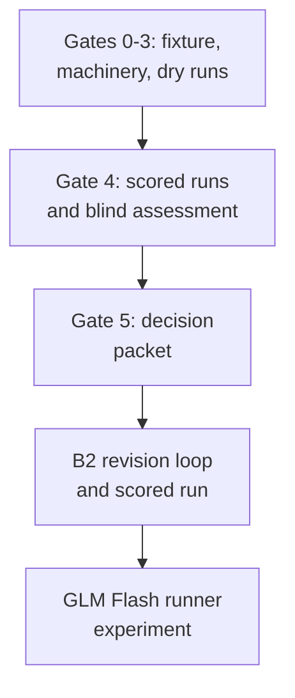

# qr2 - as-is

## Purpose

Round-2 history: design-first candidate benchmark through governance gates, the B2 revision loop, and the GLM Flash model-sensitivity experiment, ending in a hybrid recommendation.

## Design

Round 2 ran candidate C (the design-first composition instruction) against the current composition through gates 0-5: fixture proposal and review, machinery build, dry runs, scored runs, blind assessment, and a decision packet. The decision recommended a hybrid: keep the machinery, adopt the candidate's closure-ledger and boundary discipline, and add a mechanical completion gate. The B2 revision and the GLM Flash runner experiment followed. Capability accounting, review trails, and `process.json` summaries are archived here; runs and raw outputs are not stored.

**Lineage**: [as-is](../../../as-is.md#design) / [benchmarks](../../as-is.md#design) / [rounds](../as-is.md#design) / **qr2**

### Round-2 gate flow

## Links

- [`PROCESS.md`](PROCESS.md) — round-2 governance process record.
- [`decision-packet.md`](decision-packet.md) — Gate 5 decision packet (hybrid recommendation).
- [`process.json`](process.json) — machine-readable score, spend, and experiment summaries.