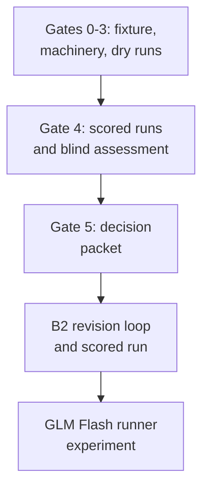

# qr2 - as-is

## Purpose

Round-2 history: design-first candidate benchmark through governance gates, the B2 revision loop, and the GLM Flash model-sensitivity experiment, ending in a hybrid recommendation.

## Design

Round 2 ran candidate C (the design-first composition instruction) against the current composition through gates 0-5: fixture proposal and review, machinery build, dry runs, scored runs, blind assessment, and a decision packet. The decision recommended a hybrid: keep the machinery, adopt the candidate's closure-ledger and boundary discipline, and add a mechanical completion gate. The B2 revision and the GLM Flash runner experiment followed. Capability accounting, review trails, and `process.json` summaries are archived here; runs and raw outputs are not stored.

**Lineage**: [as-is](../../../as-is.md#design) / [benchmarks](../../as-is.md#design) / [rounds](../as-is.md#design) / **qr2**

### Round-2 gate flow

```mermaid
---
config:
  layout: elk
---
%%{init: {"securityLevel": "loose"}}%%
flowchart TB
    Gates["Gates 0-3: fixture,<br/>machinery, dry runs"] --> Scored["Gate 4: scored runs<br/>and blind assessment"]
    Scored --> Packet["Gate 5: decision<br/>packet"]
    Packet --> B2["B2 revision loop<br/>and scored run"]
    B2 --> GLM["GLM Flash runner<br/>experiment"]
```

### Fixed-machinery re-runs and Terra cross-validation (2026-09-24/25)

After the observe-defect and path repairs, both instruction arms were re-run under the fixed machinery with equal machinery per pair. abs-medium Luna: baseline 13/30 (mean 2.17; $0.4070, 119 min) vs B2 candidate 6/30 (1.00; $0.5205, 130 min). GLM Flash (pinned `z-ai/glm-5.3-flash`): baseline 24/30 (mean 4.00; $1.0833, 94 min; zero observe-gaps, F5 budget-cap retained) vs B2 candidate 8/30 (1.33; five boundary caps). Three independent pairings now place B2 below baseline cross-model. A crash found live during the GLM baseline run (null-manifest dereference in the phase checkers when the root never freezes a manifest) was fixed to degrade gracefully to a truthful hard-gate fail; the driver's candidate-instruction path was repaired the same day.

GPT-5.6 Terra then externally validated all four fixed-machinery workspaces in two passes: a code-only review and a full-context pass replicating the machine rubric from the complete workspace plus event-derived chronology. Terra means: baseline Luna 1.50 (9/30), B2 Luna 2.00 (12/30), baseline GLM 4.50 (27/30), B2 GLM 4.00 (24/30). Terra independently confirmed the cap structure and found a real route-applicability defect in the GLM baseline that its own passing test suite does not exercise; its main divergences from the machine scorer are records-dimension leniency and one provenance judgment (Luna baseline F3). Scores from different scorers are separate axes and were never pooled.

## Links

- [`PROCESS.md`](PROCESS.md) — round-2 governance process record.
- [`decision-packet.md`](decision-packet.md) — Gate 5 decision packet (hybrid recommendation).
- [`process.json`](process.json) — machine-readable score, spend, and experiment summaries.