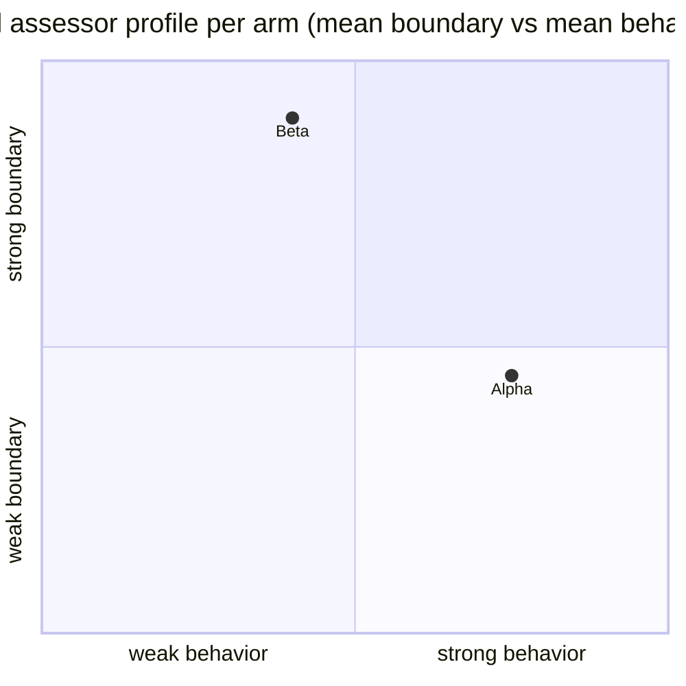

# Round 2 decision packet — thin design-first instruction vs current composition

**Question:** does a thin, portable, Sol-authored design-first instruction preserve the current composition's capabilities (delegation, routing, recovery, human-consumable design documentation) under a fixture that requires them?

**Arms:** Alpha = current composition (surface snapshot `c511642`, hash `f984a54b…`); Beta = thin candidate instruction (frozen 5,975 B, sha256 `b4725d75…a128c6`). Letters are neutral; the mapping is disclosed only here. Serving model: `openai/gpt-5.6-luna` under preset `@preset/abs-medium`, identical for both arms (round-1 consistent).

## 1. Deterministic outcomes (machine-checked, 0–5 per phase)

| Phase | Alpha | Beta | Dominant failure |
|---|---|---|---|
| F0 | 2 | 0 | Alpha: coordinator handoff missing + combined record update; Beta: **0 checkpoints**, no composition entrypoint |
| F1 | 2 | 2 | both: no runnable test entrypoint |
| F2 | 4 | 0 | Beta: missing routing handoff file; no entrypoint |
| F3 | 2 | 2 | Alpha: two missing handoffs; Beta: no entrypoint |
| F4 | 2 | 2 | Alpha: root wrote another component's record (hard boundary fail); Beta: no entrypoint |
| F5 | 4 | 2 | Alpha: no dead-letter member in tree; Beta: no entrypoint |
| **Mean** | **2.67** | **1.33** | |

**Decisive finding:** Beta built every component (sinks, router, matcher, coordinator — with tests) with exemplary boundary discipline, but **never wrote its own declared composition entry point (`src/root/entry.py`)** in any phase. The composition never integrated. The same instruction scored 5/5 on F0 in a dry run — the failure is a reliability/authorization-followthrough defect, not a capability gap. Alpha's failures are integration-discipline failures (missing handoffs, combined record update, cross-subtree write) plus a missing dead-letter member.

## 2. Blind assessment (model-level, roles annotated; no consolidation into a single score)

Phase sums are behavior/boundary/records per phase (0–5 each). Overall medians: **deciding pair (Kimi K2.6 + GLM 5.3) is tied at 2.5 for both arms** — Kimi's per-dimension pattern favors Beta's boundary (5s across F0–F5) and records, GLM's behavior column favors Alpha. Grok and Sol both rate Alpha above Beta (overall 3 vs 2).

- **Alpha (current composition):** behavior mid-strong (delegation, retry-heavy; heavy session churn — F0 needed 8+ sessions with re-delegations), boundary mid (cross-subtree write, missing handoffs), records consistently 3–4. Assessor notes: "consistently recovered from a broken harness"; "verdicts understate session churn".
- **Beta (thin candidate):** boundary 4–5 in **every phase from every assessor** (cleanest authority discipline: read-only roles stay read-only, integration via observes), records 3–5, behavior low (composition never assembled). GLM note: "one systemic fact: src/root/entry.py was [never built]".

## 3. Cost & runtime (informational, not scored)

Alpha $0.644 / 80 min; Beta $0.353 / 35 min. Per-session real `usage.cost` captured for all sessions (proxy ledger). Round-1's cost-attribution defect is fixed; cost verification is no longer a blocker.

## 4. Capability accounting (from step 3, verified before freeze)

The thin candidate's coverage file accounts for all 8 delegation capabilities the current composition exposes (per-child model/thinking, executor contracts, no-caller-inheritance, cwd origin, CLI identity wiring, alias passthrough, budget state in handoffs, checkpoint semantics). The scored run shows the *instruction text* carries these claims, but Beta's sessions **did not execute the design-first flow end-to-end under time pressure** (no checkpoints in F0 despite claiming them; no entrypoint).

## 5. Decision options (Gate 5)

1. **Consolidate** into the thin instruction — rejected by current evidence: behavior reliability under a full fixture is materially worse (1.33 vs 2.67 deterministic; behavior columns 2-ish across all four assessors).
2. **Keep** the current composition — supported by behavior scores, but leaves Beta's boundary discipline and record quality unused, and round-1's documentation-capability gap unresolved.
3. **Hybrid (recommended for discussion)** — keep the current composition's delegation/runtime machinery (which round 2 confirms is *not* the bottleneck) and adopt the candidate's **design-document discipline + boundary hard clauses** (observe-before-integrate, read-only role enforcement, consultation evidence format). The candidate's failure mode (declared-but-not-delivered entrypoint, skipped checkpoints) is exactly what a **completion assertion rule** (every declared manifest member must exist at phase end; hard-gated) would catch — this can be added to the current composition as a cheap gate, not a new instruction.

## 6. Caveats

- One candidate, one run, one fixture; variance across dry runs was large (candidate: 5/5 in dry-run, 0–2 in scored run). Temporal behavior of the composition remains unmeasured beyond telemetry counts.
- `deliver()` return shape is not mandated by the fixture; duplicate/cross-tenant probes were advisory only (no score impact).
- Assessor role accumulation disclosed: Grok reviewed protocol/fixture/wrapper (reported separately); Sol authored the instruction (labeled author-analysis). Costs, models, and timing removed from blind packets.
- Total round-2 spend: ≈ $2.0 (design $1.05 + machinery dry $0.43 + scored run $1.00 + assessment $0.54).
