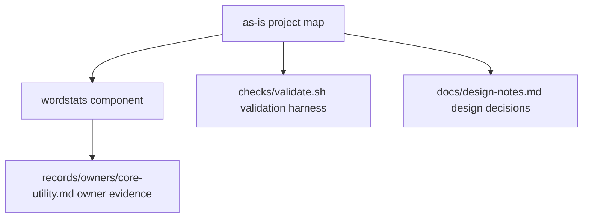

# as-is - as-is

Canonical architecture map for the wordstats benchmark seed project: a tiny Python word-count utility with a deterministic validation harness.

## Components

- [wordstats](src/wordstats/as-is.md#design) — word-count library and `count` CLI (owns `src/wordstats/`).

## Project context

- `checks/validate.sh` — deterministic validation entry point (compile check, unit tests, CLI smoke check against `checks/expected-count.json`).
- `records/ownership-map.md` — mock ownership records used for component/scope resolution.
- `docs/design-notes.md` — human-facing design notes recorded before bounded user-visible changes.
- `sample-data/words.txt` — fixed smoke-check input.

