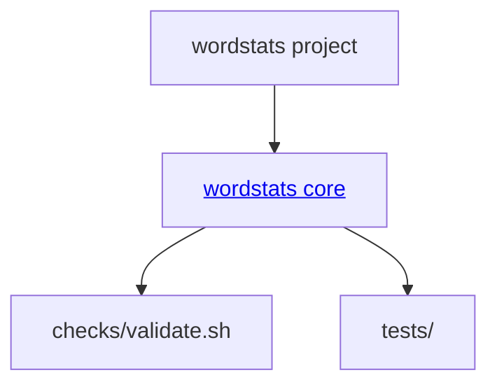

# wordstats - as-is

## Purpose

Provide a small deterministic Python word-count library and JSON command-line interface for counting normalized words in UTF-8 text files.

## Components

| Component | Purpose |
| --- | --- |
| [wordstats core](src/wordstats/as-is.md#design) | Own word normalization, frequency counting, summary statistics, and the `count` CLI. |

## Design

**Lineage**: **wordstats**

The project keeps the executable wordstats behavior in `src/wordstats/`; tests and the deterministic check script validate that component without becoming separate runtime components.

## Relationships

- `src/wordstats/` provides the library and CLI contract to project users.
- `tests/` exercises the component's public behavior.
- `checks/validate.sh` is the project-level deterministic validation entry point.
- `docs/design-notes.md` records user-visible design decisions.

## Links

- [`src/wordstats/as-is.md`](src/wordstats/as-is.md) — component architecture and boundaries.
- [`docs/design-notes.md`](docs/design-notes.md) — project design-note convention.
- [`records/ownership-map.md`](records/ownership-map.md) — supplied ownership evidence.
