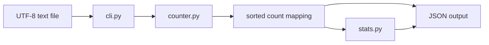

# wordstats core - as-is

## Purpose

Own deterministic word normalization, frequency counting, summary statistics, and the JSON `count` command.

## Components

| Part | Responsibility |
| --- | --- |
| `counter.py` | Normalize tokens and return word-frequency mappings. |
| `stats.py` | Derive minimum, maximum, median, and unique-word summary values from counts. |
| `cli.py` | Parse `count` arguments, read UTF-8 input, and emit sorted JSON. |
| `../../tests/` | Focused support tests for the public component behavior. |

## Design

**Lineage**: [wordstats](../../as-is.md#design) / **wordstats core**

The default `count` output remains the sorted frequency mapping. When `--stats` is selected, the CLI appends a summary object derived from the count values; the summary calculation is kept in `stats.py` so it is independently testable and does not mutate the input mapping.

## Relationships

- `cli.py` consumes `counter.py` and conditionally `stats.py`.
- `stats.py` consumes only a count mapping and returns summary data.
- `docs/design-notes.md` is the authority for the user-visible output decision.
- `records/owners/core-utility.md` owns the source behavior under `src/wordstats/`.

## Links

- [`../../as-is.md`](../../as-is.md#design) — project record.
- [`../../docs/design-notes.md`](../../docs/design-notes.md) — output design decision.
- [`../../records/ownership-map.md`](../../records/ownership-map.md) — ownership map.
