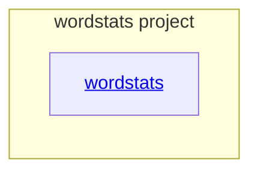

# wordstats project - as-is

## Purpose

Own the tiny word-count project, its command-line interface, focused tests, deterministic checks, sample data, and project documentation.

## Components

| Component | Purpose |
| --- | --- |
| [wordstats](src/wordstats/as-is.md#design) | Count normalized words and expose the `wordstats count` JSON command. |

## Design

The project keeps word-count behavior in `src/wordstats/`, validates it with `tests/` and `checks/validate.sh`, and records user-visible decisions in `docs/design-notes.md`.

**Lineage**: **wordstats project**

### Project structure

The `wordstats` component owns implementation behavior and its CLI. Project documentation owns design decisions and the README. The root `CHANGELOG.md` is the durable project history location named by the seed.

## Links

- [`records/ownership-map.md`](records/ownership-map.md) — mock project ownership resolution.
- [`docs/design-notes.md`](docs/design-notes.md) — user-facing design decisions.
- [`checks/validate.sh`](checks/validate.sh) — deterministic validation entry point.
