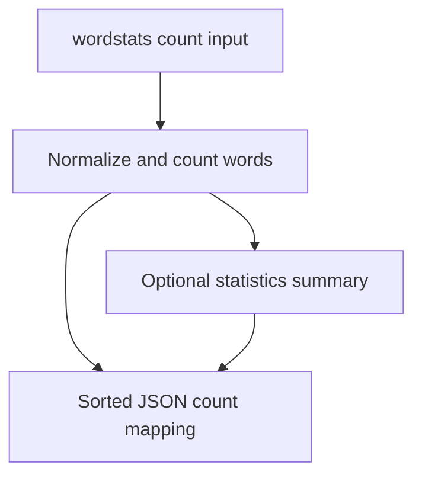

# wordstats - as-is

## Purpose

Own normalized word counting and the `wordstats count` command, including focused unit coverage.

## Design

The component normalizes lowercase whitespace-delimited tokens, strips punctuation from token edges, ignores punctuation-only tokens, and returns mappings. The CLI reads UTF-8 text and emits sorted, indented JSON. The optional `--stats` mode appends a summary object containing minimum count, maximum count, median count, and number of unique words while preserving the existing count mapping when the option is absent.

**Lineage**: [wordstats project](../../as-is.md#design) / **wordstats**

### Count and summary flow

The component boundary covers the source package. `records/ownership-map.md` identifies the core-utility owner for this component; `docs/design-notes.md` owns the user-visible output decision, and `CHANGELOG.md` owns durable history.

## Links

- [`counter.py`](counter.py) — word normalization and counting.
- [`cli.py`](cli.py) — command-line parsing and JSON output.
- [`../../docs/design-notes.md`](../../docs/design-notes.md) — user-facing design decision.
